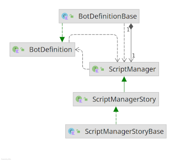
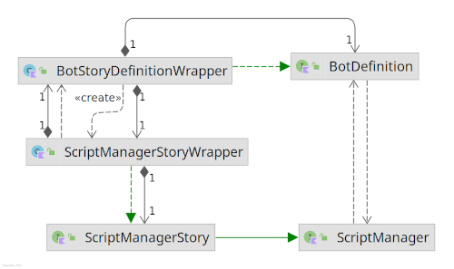
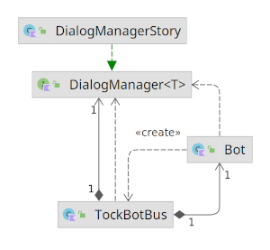
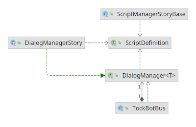

#Abstraction des Story
Dans TOCK (The Open Conversation Kit), les story est l'object porteur des interractions (messages, actions, choix ...). C'est avec, et au travers des story que l'engine de TOCK trouve l'étape suivante de la discution.

## Story
Une Story est un bout de conversation à propos d'un sujet précis.
Elle est liée au minimum a une intention (intent), la StarterIntent. Elle peut avoir des Step ayant elles mêmes des intentions.

Il n'y a pas de service "sélection de story" comme il peut y avoir une bibliothèque de lecture du scxml pour la machine à état, le routage des story fait partie du moteur de manière générale.

Ce routage est réalisé en explorant la liste des story connu pour un bot (par rapport aux intentions), ainsi que des étapes de la story en cours.

### Pre-defined story slot
Ce sont des StoryDefinition appelées à divers moments dans le bot en-dehors du flux classique, généralement pour une action spécifique.
- unknownStory : Story par default si aucune intention n'est détectée
- keywordStory : Si un mot clef est reconnu dans le message utilisateur, court-circuit le NLP et lance directement cette story
- helloStory : Lancée au démarrage du bot
- goodbyeStory : Lancée à la sortie du bot
- noInputStory :  appelée si l'utilisateur est inactif
- userLocationStory : Story utilisée pour l'action SendLocation
- handleAttachmentStory : Story utilisée pour l'action SendAttachment

## ScriptManager
Tel que TOCK a été conçu, les pré-defined story slot, ainsi que la liste des story connues, sont enregistrées dans la BotDefinition (la structure de configuration du bot). Ce qui implique qu'un bot est fortement lié aux objets de type story. Pour pouvoir mettre oeuvre un ensemble d'objet représentant le dialogue, autre que des storys (permettant de représenter un dialog évoluant différement, machine à état, graphe-résolveur, approche statistique ...), il était nécessaire de créer une première forme d'abstraction permettant un stockage découplé de l'objet BotDefinition.
Le ScriptManager est une interface d'abstraction qui vient remplir ce rôle. Le ScriptManager offre des accesseurs aux abstractions de story, indépendament des mécanismes de résolution des intentions.
L'interface ScriptManager manipule des Script, dont étentent les Story. De cette manière, il est possible de stocker d'autre sorte de Script qui ne soit pas du tout des Story, et donc la résolutions des intentions nécessite une structure très différente.

### ScriptManagerWrapper
Le BotDefinition, qui contenait la configuration du bot ainsi que les Story, est encapsulé dans un objet BotStoryDefinitionWrapper. Lorsqu'un Bot est instancier, sa configuration est en partie surchargé par un wrapper qui apport le support de d'autre type de Story et ajoute de nouveaux mécanisme de résolution des intentions, en plus des de ceux de base.
Pour garder de la cohérence par rapport au ScriptManagerStory, les méthodes du BotStoryDefinitionWrapper qui dépendent maintenant du ScriptManager, ont donc été encapsulé dans un ScriptManagerStoryWrapper. Le travail n'a pas été ici poussé jusqu'à l'abstration des wrappers.

##Historique
L'historique de l'exécution des story est stoqué dans 2 structures ayant un role quelques peut différent, le Dialog, et la UserTimeLine

###Dialog
Un Dialog est un objet stockant une succession des Story lier entre elle. C'est le cas par exemple lorsqu'une Story est une Step d'une autre Story.
Le Dialog est donc fortement lier au type Story. Ce qui complexifie l'abstration du mécanisme de résolution des Story tel qu'il existe.

###UserTimeLine
Contient les informations d'un dialogue complet entre un chatbot et un utilisateur ainsi que les données utilisateurs.
La UserTimeLine expose la dernière Action du dialog (bot) et la dernière UserAction (user) [Action](http://doc.tock.ai/tock/dokka/tock/ai.tock.bot.engine.action/-action/index.html)
Une UserTimeLine est fortement typé pour traité des Story et des Dialog de Story. Cet objet contient la liste ordonné des précédents Dialog lié à la conversation en cours, et est capable de retourner le Dialog courrant (s'il y en a un), la Story courante (qui est la Story du Dialog courrant), ainsi que la dernière action et la dernière action utilisateur

###modification technique
L'engine exploite la UserTimeLine et les Dialog pour réaliser la résolution de l'intention. Pour permettre l'usage de l'abstration Script en lieu et place des Story, il a été nécessaire de templater le Dialog en Dialog\<T\> ainsi que la UserTimeLine en UserTimeLine\<T\> où T est un implémentation de Script, pour supporter l'ajout de Script qui ne soit pas étendu de Story.

##DialogManager
Le role du DialogManager est de calculer la transition vers un script en fonction d'une intention, d'un contexte et optionnellement d'un ensemble d'entitées.

###fonctionnement technique
Actuellement, la transition entre 2 Story (ou entre 2 Step d'une même Story) est géré d'une manière globale par TOCK. Plusieurs mécanismes (celon que le bot fonctionne en intégré ou en API) permettent de déterminer la suite de l'exécution celon différents critères :
- bot activé ?
- bot en cours de désactivation ?
- story activé ?
- l'une des étapes de la story contient la nouvelle intention ?
- l'une des story du bot contient l'intention en première intention ?
- la story précédente impose la détection d'une intention parmit un ensemble pour poursuivre son execution ?
- ...
  Aux mécanismes existants s'ajoute des mécanismes pouvant être surchargés par des implémentations spéficiques exploitant TOCK.
  Contrairement au NLP qui dispose d'une API, le mécanisme de gestion du dialog est dispatché dans plusieurs couches de TOCK.

Une partie de ces traitements, fortement lier aux Story ont été grouper dans la class DialogManagerStory qui étend de DialogManager\<T\>. Qui est lui même un mécanisme du Bot et du TockBotBus exploiter pour résoudre une intention.

Dans le fonctionnement de la résolution de l'intention, qui intervient dans le Bus (implémenté en TockBotBus), Le DialogManager à besoin de pouvoir accédé au stockage des Script eux même. C'est pourquoi il existe un lien entre le DialogManager et le ScriptManager

##DialogManagerFactory
Le DialogManager\<T\> est une interface permettant de recevoir une implémentation spécifique en fonction du type de DialogManager exploité. Le but est de rendre le DialogManager modulaire pour qu'il puisse accepter de nouvelles implémentations spéficique, de la même manière que le NLP. Par la suite il serait approprié de remplacer ce type d'implémentation par une API permettant une instanciation du DialogManager dans un micro service.
En l'état, le DialogManagerFactory permet d'instancier un DialogManager spécifique, lier au type de Script manipulé par le bot.
Tel que l'implémentation à été réalisé ici, il n'est pas possible d'utiliser plusieurs implémentation différente de Script.

