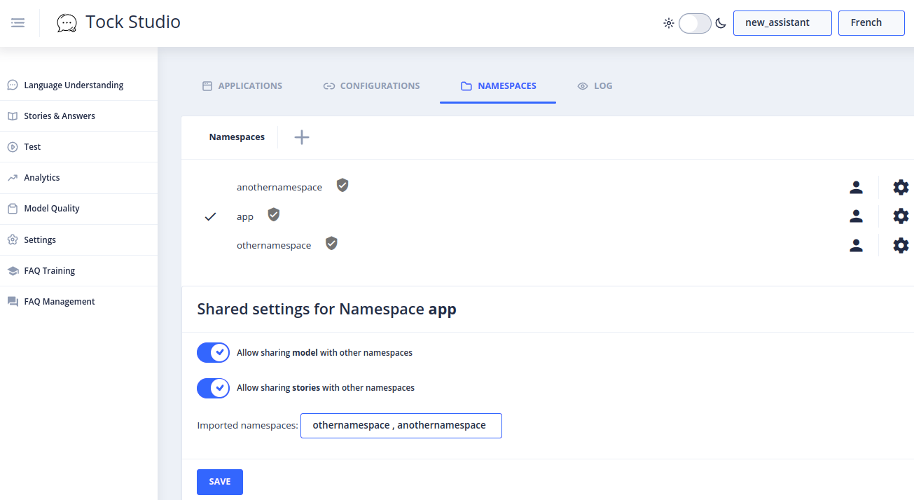

# Partage de modèle (fonctionnalité en alpha)

Le concept d'intention partagée permet de partager des intentions, des stories des modèles entrainées selon deux modes :

- Celle au sein du même namespace
- Celle entre namespace

## Partage au sein du même namespace
# Intention partagée 
  - Si lors de la création d'une story, le nom de l'intention est équivalent à une intention existante dans un autre bot du même namespace alors il est proposé de partager l'entraînement des phrases concernant les deux stories.
  - Si lors de la création d'une FAQ, le nom de l'intention qui est lié de façon inhérente à la FAQ et si cette dernière créée est équivalente à une story existante (une FAQ est une abstraction complémentaire d'une story) alors il est proposé de partager la story existante ou d'en créer une nouvelle.

  

  - Une intention va alors être utilisée par deux stories (lien story et FAQ par exemple) différentes ainsi la reconnaissance de l'intention via NLU est partagée mais la réponse et son fonctionnement est distincte.
  
## Partage entre namespace
Il est possible de donner un droit d'accès à d'autres namespace et de profiter d'autres namespaces partagées.

Le partage est possible pour :
- le modèle entraîné
- les stories

Cependant, cela nécessite d'également partager son modèle et rebuilder le modèle sur une application pour en profiter en allant dans `Settings/<application>/Edit/Advanced options/ Trigger Build` )
Ensuite vous êtes en capacité de déclencher les intentions d'un autre namespace mais il est nécessaire d'associer l'intention à une story afin de pouvoir dérouler sa réponse, son processus (lien story)

