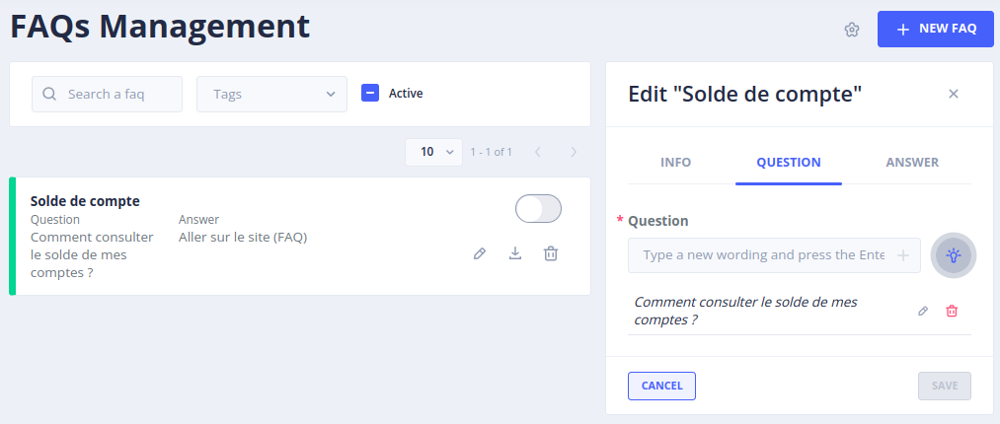

# Le menu _Gen AI - Sentence generation settings_

Le menu _Gen AI - Sentence Generation_ permet de configurer la fonctionnalité de génération de phrases d'entraînement pour les bots FAQ.

> Pour accéder à cette page il faut bénéficier du rôle **_botUser_**. 
>  ( plus de détails sur les rôles dans [securité](../../../../admin/securite.md#rôles) ).

Le Menu FAQ Management

Pour utiliser l’option Generate Sentence :

Sélectionner une phrase qui servira de base d'entraînement.
Cliquer sur Modifier puis sur Questions:

Cliquer sur l’ampoule, une fenêtre avec de nouveaux paramètres apparaît :

TODO IMAGE

Choisir la ou les questions qui serviront de base d'entraînement.
Choisir si l’IA doit inclure des fautes d’orthographe, du langage de type SMS et des abréviations.
La température par défaut est celle qui a été choisie dans les Settings mais elle peut être modifiée ici selon le besoin.
Cliquer sur Generate.

L’IA va générer une liste de variantes de la question sélectionnée pour l'entraînement.
Sélectionner les variantes les plus appropriées à la requête et valider la sélection.

Les phrases  issues de la session d'entraînement apparaîtront alors dans les questions de la FAQ.

------------ TODO MASS ------------------------
Rendez-vous dans [Menu _FAQ Management_](../faq-management) pour la suite du manuel utilisateur. 

> Vous pouvez aussi passer directement au chapitre suivant : [Développement](../../../dev/modes). 