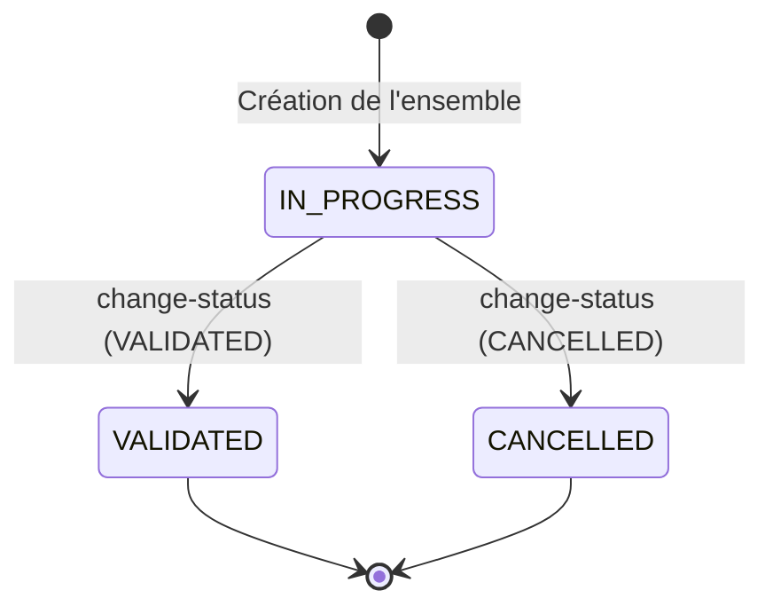

# Modèle de domaine

## 1. Concepts métier

### 1.1 Ensemble d'évaluation (EvaluationSet)

Un **ensemble d'évaluation** représente une campagne d'évaluation. Il contient un ensemble de réponses du bot sélectionnées sur une période donnée.

| Attribut | Description |
|----------|-------------|
| `_id` | Identifiant unique |
| `botId` | Identifiant du bot (applicationName) |
| `name` | Nom optionnel pour identifier l'ensemble |

> **Note sur l'identité du bot :**
> - Le `botId` correspond à l'`applicationName` dans Tock
> - Le `namespace` est récupéré depuis le **contexte utilisateur** (session/token), pas stocké dans l'entité
> - Un bot est **uniquement identifié** par le couple `namespace + applicationName`
> - Un même `applicationName` peut exister dans différents namespaces (multi-tenant)
| `description` | Description libre de l'objectif de l'évaluation |
| `dialogActivityFrom` | Date de début de la période d'activité des dialogs |
| `dialogActivityTo` | Date de fin de la période d'activité des dialogs |
| `requestedDialogCount` | Nombre de dialogs demandés |
| `dialogsCount` | Nombre de dialogs retournés (peut différer si pas assez de dialogs) |
| `totalDialogCount` | Nombre total de dialogs dans la période (indépendamment de la limite) |
| `botActionCount` | Nombre total d'actions du bot retournées |
| `allowTestDialogs` | Autoriser ou non les dialogs de test |
| `botActionRefs` | Liste des références aux actions à évaluer |
| `status` | État de l'ensemble (`IN_PROGRESS`, `VALIDATED`, `CANCELLED`) |
| `createdBy` | Utilisateur ayant créé l'ensemble |
| `creationDate` | Date de création |
| `statusChangedBy` | Utilisateur ayant changé le statut (initialisé avec `createdBy`) |
| `statusChangeDate` | Date du changement de statut (initialisé avec `creationDate`) |
| `statusComment` | Commentaire associé au changement de statut (null à la création) |
| `lastUpdateDate` | Date de dernière mise à jour |

### 1.2 Référence d'action bot (BotActionRef)

Une référence vers une action du bot à évaluer.

| Attribut | Description |
|----------|-------------|
| `dialogId` | Identifiant du dialog |
| `actionId` | Identifiant de l'action dans le dialog |

### 1.3 Résultat d'évaluation (EvaluationsResult)

> **Note:** Calculé à la volée, non persisté en base.

| Attribut | Description |
|----------|-------------|
| `total` | Nombre total d'évaluations |
| `evaluated` | Nombre d'évaluations effectuées (UP ou DOWN) |
| `remaining` | Nombre d'évaluations restantes (UNSET) |
| `positiveCount` | Nombre d'évaluations UP |
| `negativeCount` | Nombre d'évaluations DOWN |

### 1.4 Évaluation (Evaluation)

Une **évaluation** est le jugement porté sur une réponse du bot. Initialisée à la création de l'ensemble avec un statut `UNSET` et sans évaluateur.

| Attribut | Description |
|----------|-------------|
| `_id` | Identifiant unique |
| `evaluationSetId` | Référence à l'ensemble d'évaluation |
| `dialogId` | Référence au dialog d'origine |
| `actionId` | Référence à l'action d'origine |
| `status` | `UNSET`, `UP` ou `DOWN` |
| `reason` | Raison du DOWN (nullable) |
| `evaluator` | Information sur l'évaluateur (nullable si UNSET) |
| `evaluationDate` | Date de l'évaluation (nullable si UNSET) |
| `creationDate` | Date de création |
| `lastUpdateDate` | Date de dernière mise à jour |

### 1.5 Évaluateur (Evaluator)

L'évaluateur représente l'entité qui a effectué l'évaluation.

| Attribut | Description |
|----------|-------------|
| `id` | Identifiant de l'évaluateur |

> **Note:** L'évaluateur est détecté automatiquement depuis le contexte utilisateur, pas fourni dans les requêtes API.

---

## 2. Enums

### 2.1 Statut d'évaluation (EvaluationStatus)

| Valeur | Description |
|--------|-------------|
| `UNSET` | Non évalué (valeur initiale) |
| `UP` | Évaluation positive |
| `DOWN` | Évaluation négative |

### 2.2 Statut d'ensemble (EvaluationSetStatus)

| État | Description |
|------|-------------|
| `IN_PROGRESS` | Évaluation en cours |
| `VALIDATED` | Évaluation terminée et validée |
| `CANCELLED` | Ensemble annulé |

### 2.3 Raisons de DOWN (EvaluationReason)

Réutilisation de la liste des annotations existantes :

| Valeur | Description |
|--------|-------------|
| `INACCURATE_ANSWER` | Réponse inexacte |
| `INCOMPLETE_ANSWER` | Réponse incomplète |
| `HALLUCINATION` | Hallucination |
| `INCOMPLETE_SOURCES` | Sources incomplètes |
| `OBSOLETE_SOURCES` | Sources obsolètes |
| `WRONG_ANSWER_FORMAT` | Mauvais format de réponse |
| `BUSINESS_LEXICON_PROBLEM` | Problème de lexique métier |
| `QUESTION_MISUNDERSTOOD` | Question mal comprise |
| `OTHER` | Autre |

> **TODO:** Vérifier si on utilise les mêmes valeurs que pour les annotations existantes.

---

## 3. Cycle de vie

### 3.1 EvaluationSet

> **Note:** Pas d'état CREATED. L'ensemble passe directement en IN_PROGRESS à la création.
> Si la création échoue partiellement, l'ensemble et les évaluations créées doivent être rollback (transaction).

### 3.2 Transitions autorisées

| Statut actuel | Transitions autorisées |
|---------------|------------------------|
| `IN_PROGRESS` | `VALIDATED`, `CANCELLED` |
| `VALIDATED` | aucune |
| `CANCELLED` | aucune |

---

## 4. Règles métier

### 4.1 Création d'ensemble

| # | Règle |
|---|-------|
| R1 | Les dialogs **annotés** (via le système d'annotations existant) sont **exclus** |
| R2 | Les dialogs sont sélectionnés dans la période spécifiée, par période d'activité (**aléatoirement**) |
| R3 | Si `allowTestDialogs = false`, exclure les dialogs de test |
| R4 | Si pas assez de dialogs/réponses disponibles → **prendre tout ce qui est disponible** |
| R5 | Les évaluations sont créées avec `status = UNSET` et `evaluator = null` |
| R6 | `statusChangedBy` et `statusChangeDate` sont initialisés avec les valeurs de création |
| R7 | La création est **transactionnelle** (rollback si échec partiel) |

### 4.2 Sélection des réponses à évaluer

| # | Règle |
|---|-------|
| R8 | **Filtrage par période** : dialogs ayant eu une activité entre `dialogActivityFrom` et `dialogActivityTo` |
| R9 | **Filtrage par émetteur** : actions du **bot** uniquement |

> **Précision sur R8 - Filtrage par période d'activité :**
> 
> Un dialog est considéré comme ayant eu une activité pendant la période spécifiée si :
> - Il possède **au moins une action** dont la date est **≥ activityFrom** (borne inférieure)
> - Il possède **au moins une action** dont la date est **< activityTo** (borne supérieure)
> 
> Ces deux conditions **ne doivent pas nécessairement porter sur la même action**.
> 
> Équivalence mathématique :
> - `∃ action.date >= activityFrom` ⟺ `max(actions.date) >= activityFrom`
> - `∃ action.date < activityTo` ⟺ `min(actions.date) < activityTo`

### 4.3 Évaluation

| # | Règle |
|---|-------|
| R10 | Une réponse peut être **réévaluée** tant que l'ensemble n'est pas validé |
| R11 | Les dialogs déjà évalués peuvent réapparaître dans un nouvel ensemble (vierges) |
| R12 | La **raison du DOWN est optionnelle** |
| R13 | **Plusieurs évaluateurs** peuvent travailler simultanément |
| R14 | Un évaluateur **peut modifier** l'évaluation d'un autre évaluateur |
| R15 | En cas de **conflit d'écriture** (erreur BDD), retourner une erreur **409 Conflict** |
| R16 | L'**évaluateur est détecté automatiquement** depuis le contexte utilisateur |

### 4.4 Changement de statut

| # | Règle |
|---|-------|
| R17 | Le changement de statut utilise une **API unique** `change-status` |
| R18 | **Validation** : Toutes les réponses doivent être évaluées (pas de `UNSET` restant) |
| R19 | Une fois **validé**, l'ensemble **ne peut plus être modifié** |
| R20 | Une fois **annulé**, l'ensemble **ne peut plus être modifié** |
| R21 | **Tout utilisateur** avec les droits peut valider ou annuler un ensemble |

### 4.5 Conservation et purge

| # | Règle |
|---|-------|
| R22 | Les ensembles sont **purgés** |
| R23 | La liste de l'ensemble des échantillons affiche les ensembles des **365 derniers jours** |
| R24 | Si un dialog est purgé, l'évaluation reste mais le contexte est perdu |
| R25 | L'API retourne les dialogs **trouvés** (`found`) et les références **manquantes** (`missing`) |

---

## 5. Questions tranchées

| # | Question | Réponse |
|---|----------|---------|
| Q1 | Sélection des dialogs | Aléatoire |
| Q2 | Pas assez de réponses | Prendre tout |
| Q4 | Stocker `userMessage` / `botMessage` ? | Non, utilisation des dialogs existants |
| Q5 | Format d'export | PDF (feature séparée, hors scope) |
| Q6 | Valeurs d'évaluation | UP, DOWN, UNSET |
| Q7 | Initialisation des évaluations | Créées à la création de l'ensemble avec UNSET |
| Q8 | API validation/annulation | change-status unique |
| Q9 | Évaluateur dans le body | Non, détecté depuis le contexte |

