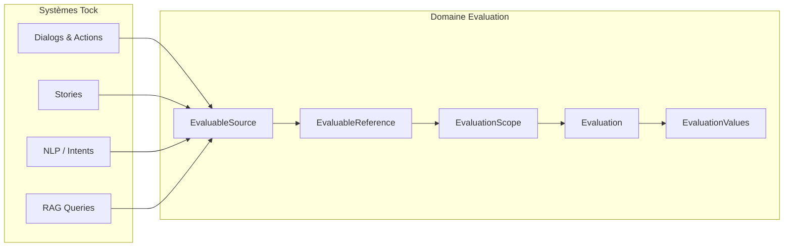
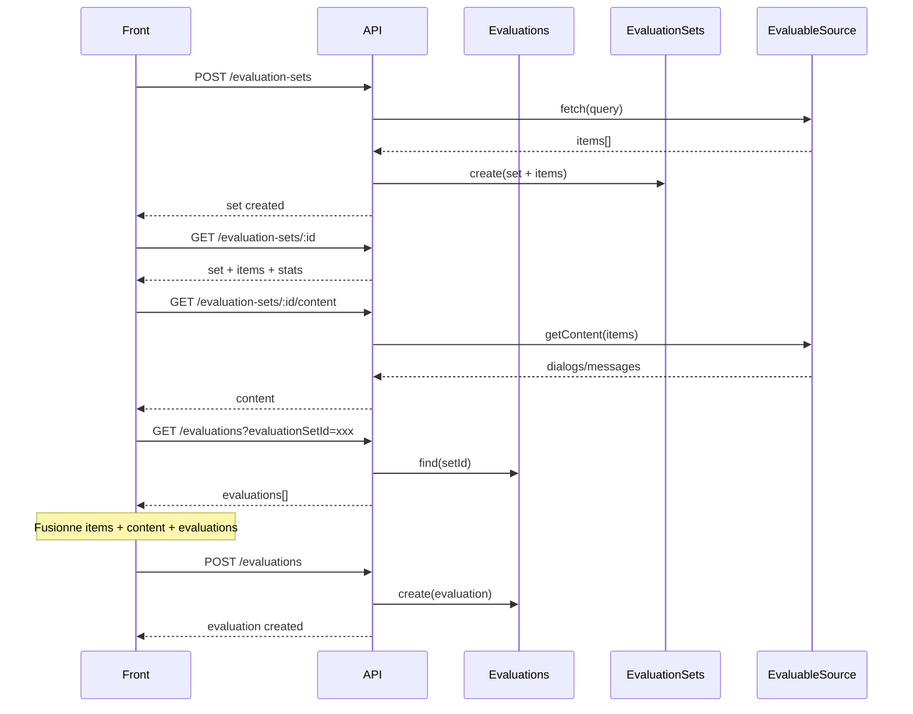

# Repenser le domaine d'évaluation pour Tock

> ⚠️ **TOO EARLY** - Ce document contient des réflexions exploratoires sur une évolution future du modèle d'évaluation vers un domaine plus générique et agnostique. Ces concepts ne sont pas encore applicables au design actuel.

## 1. Constat initial

Le design actuel de l'évaluation dans Tock présente plusieurs limitations :

- **Approche par cas d'usage** : On est parti de l'échantillonnage (use case) et non du domaine métier (évaluation)
- **Couplage fort** : L'évaluation est liée au sample, au stockage, aux structures Tock (`dialogId`, `actionId`)
- **Extensibilité limitée** : Ajouter un nouveau canal (feedback utilisateur, LLM) nécessiterait une refonte

**Proposition** : Définir un domaine d'évaluation pur, agnostique du système évalué.

---

## 2. Objectifs du domaine

Concevoir un domaine d'évaluation permettant :

- **Plusieurs canaux d'évaluation** : User (feedback live), Admin (QA), Automated (LLM)
- **Plusieurs évaluateurs** : Humain, IA, Système
- **Plusieurs types de valeurs** : Emoji, texte, score numérique, boolean, échelle
- **L'évaluation de différents scopes** : Message, conversation, segment, ensemble
- **La récupération des éléments depuis leur source** : Via une interface abstraite
- **Une séparation stricte** entre domaine, UI et infrastructure

---

## 3. Concepts clés - Vue d'ensemble

| Concept | Rôle |
|---------|------|
| **Evaluation** | Acte d'évaluer - l'agrégat racine |
| **EvaluationScope** | Périmètre évalué (ce qu'on évalue) |
| **EvaluationChannel** | Contexte d'origine de l'évaluation |
| **Evaluator** | Qui ou quoi évalue |
| **EvaluationValue** | Résultat produit |
| **EvaluationCriterion** | Axe évalué |
| **EvaluationSet** | Ensemble d'éléments à évaluer |
| **EvaluableSource** | Source des éléments évaluables |

---

## 4. Définition détaillée des concepts

### 4.1 Evaluation (Agrégat racine)

L'évaluation est l'acte de porter un jugement sur un élément. C'est l'agrégat racine du domaine.

```kotlin
class Evaluation {
    val id: EvaluationId
    val scope: EvaluationScope       // Ce qu'on évalue
    val channel: EvaluationChannel   // D'où vient l'évaluation
    val evaluator: Evaluator         // Qui évalue
    val values: Set<EvaluationValue> // Résultats (≥ 1)
    val createdAt: Instant
}
```

#### Invariants

1. Une évaluation porte sur **un seul scope**
2. Une évaluation provient d'**un seul canal**
3. Une évaluation est faite par **un seul évaluateur**
4. Une évaluation contient **au moins une valeur**
5. Une évaluation **ne connaît pas** le chatbot, l'UI, ni le stockage

Ces invariants garantissent que l'évaluation est un concept pur du domaine, sans dépendance technique.

---

### 4.2 EvaluationScope

Le scope définit **ce qui est évalué**. C'est le concept central : on évalue toujours quelque chose de précis.

```kotlin
class EvaluationScope {
    val type: ScopeType
    val reference: ScopeReference
}
```

#### ScopeType

Le type de scope détermine la granularité de l'évaluation, en utilisant le vocabulaire Tock :

```kotlin
enum class ScopeType {
    ACTION,          // Une action (message du bot ou de l'utilisateur)
    BOT_ACTION,      // Une action du bot uniquement (réponse)
    DIALOG,          // Un dialogue complet (conversation)
    DIALOG_SEGMENT,  // Une portion de dialogue (échange Q/R)
    STORY,           // Une story (scénario conversationnel)
    INTENT,          // Une intention NLU
    RAG_QUERY        // Une requête RAG avec sa réponse
}
```

#### ScopeReference

La référence permet de retrouver l'élément dans son système source, sans créer de dépendance :

```kotlin
class ScopeReference {
    val externalId: String     // ID dans le système source
    val sourceSystem: String   // Identifiant du système source
}
```

#### Description des ScopeTypes

| ScopeType | Description | Exemple de référence |
|-----------|-------------|----------------------|
| `ACTION` | Une action (bot ou user) | `{ externalId: "action_001", sourceSystem: "tock" }` |
| `BOT_ACTION` | Une réponse du bot | `{ externalId: "action_001", sourceSystem: "tock" }` |
| `DIALOG` | Un dialogue complet | `{ externalId: "dialog_abc", sourceSystem: "tock" }` |
| `DIALOG_SEGMENT` | Portion de dialogue | `{ externalId: "dialog_abc:0-3", sourceSystem: "tock" }` |
| `STORY` | Une story/scénario | `{ externalId: "story_greetings", sourceSystem: "tock" }` |
| `INTENT` | Une intention NLU | `{ externalId: "intent_booking", sourceSystem: "tock-nlp" }` |
| `RAG_QUERY` | Requête RAG | `{ externalId: "rag_query_123", sourceSystem: "tock-rag" }` |

#### Extensibilité

De nouveaux types de scope peuvent être ajoutés selon les besoins futurs :

| Scope potentiel | Description |
|-----------------|-------------|
| `SENTENCE` | Une phrase annotée NLP |
| `FAQ` | Une entrée FAQ |
| `CONFIGURATION` | Un élément de configuration bot |

---

### 4.3 EvaluationChannel

Le canal indique le **contexte d'origine** de l'évaluation : qui a initié l'évaluation et dans quel contexte.

```kotlin
enum class EvaluationChannel {
    USER,      // Feedback live de l'utilisateur final
    ADMIN,     // Évaluation QA par un humain (back-office)
    AUTOMATED  // Évaluation automatique (LLM, règles, système)
}
```

| Canal | Description | Cas d'usage Tock |
|-------|-------------|------------------|
| `USER` | L'utilisateur final donne son avis | Pouce up/down après une réponse du bot |
| `ADMIN` | Un admin évalue dans le back-office | Échantillonnage QA pré-production |
| `AUTOMATED` | Un système évalue automatiquement | LLM qui score les réponses RAG |

#### Pourquoi distinguer le canal ?

- **Traçabilité** : Savoir d'où vient l'évaluation
- **Pondération** : Une évaluation ADMIN peut avoir plus de poids qu'un feedback USER
- **Analyse** : Comparer les évaluations par canal

---

### 4.4 Evaluator

L'évaluateur indique **qui ou quoi** a produit l'évaluation.

```kotlin
class Evaluator {
    val id: EvaluatorId
    val type: EvaluatorType
}
```

```kotlin
enum class EvaluatorType {
    HUMAN,   // Personne physique (admin, utilisateur)
    AI,      // Intelligence artificielle (LLM)
    SYSTEM   // Règle automatique, script
}
```

| Type | Description | Exemples |
|------|-------------|----------|
| `HUMAN` | Personne physique | Admin Tock, utilisateur final |
| `AI` | Intelligence artificielle | GPT-4, Claude, modèle custom |
| `SYSTEM` | Règle automatique | Détection de pattern, seuil de confiance |

#### Distinction Channel vs Evaluator

- **Channel** = contexte (d'où vient l'évaluation)
- **Evaluator** = acteur (qui a fait l'évaluation)

Exemples :
- Channel `USER` + Evaluator `HUMAN` = feedback utilisateur classique
- Channel `AUTOMATED` + Evaluator `AI` = scoring LLM
- Channel `AUTOMATED` + Evaluator `SYSTEM` = règle métier automatique
- Channel `ADMIN` + Evaluator `HUMAN` = QA manuel

---

### 4.5 EvaluationValue et EvaluationCriterion

Une évaluation produit une ou plusieurs **valeurs** sur un ou plusieurs **critères**.

#### EvaluationCriterion

Le critère définit **l'axe évalué** :

```kotlin
class EvaluationCriterion {
    val name: String  // Ex: "quality", "relevance", "helpfulness", "accuracy"
}
```

Exemples de critères :
- `quality` : La réponse est-elle de bonne qualité ?
- `relevance` : La réponse est-elle pertinente par rapport à la question ?
- `helpfulness` : La réponse aide-t-elle l'utilisateur ?
- `accuracy` : La réponse est-elle exacte ?
- `reason` : Quelle est la raison d'un KO ?

#### EvaluationValue

La valeur associe un critère à un résultat :

```kotlin
class EvaluationValue {
    val criterion: EvaluationCriterion
    val value: Value
}
```

#### Value (polymorphe)

L'interface `Value` permet différents types de résultats :

```kotlin
interface Value

class BooleanValue(val value: Boolean) : Value           // OK/KO, Oui/Non
class NumericValue(val value: Double) : Value            // Score 0.0-1.0
class TextValue(val value: String) : Value               // Commentaire, raison
class EmojiValue(val value: String) : Value              // 👍 👎 😐
class ScaleValue(val value: Int, val max: Int) : Value   // 3/5, 4/10
```

#### Adaptation du design actuel

| Design actuel | Nouveau design |
|---------------|----------------|
| `evaluation: OK` | `{ criterion: "quality", value: BooleanValue(true) }` |
| `evaluation: KO` | `{ criterion: "quality", value: BooleanValue(false) }` |
| `reason: HALLUCINATION` | `{ criterion: "reason", value: TextValue("HALLUCINATION") }` |

#### Évaluation multi-critères

Une même évaluation peut contenir plusieurs valeurs :

```json
{
  "values": [
    { "criterion": { "name": "quality" }, "value": { "type": "boolean", "value": true } },
    { "criterion": { "name": "relevance" }, "value": { "type": "numeric", "value": 0.85 } },
    { "criterion": { "name": "comment" }, "value": { "type": "text", "value": "Bonne réponse" } }
  ]
}
```

---

### 4.6 EvaluationSet

Un ensemble d'éléments à évaluer, regroupés pour un objectif commun.

```kotlin
class EvaluationSet {
    val id: EvaluationSetId
    val name: String
    val purpose: String
    val items: Set<EvaluableReference>
    val createdAt: Instant
}
```

```kotlin
class EvaluableReference {
    val type: ScopeType           // BOT_ACTION, DIALOG, RAG_QUERY, etc.
    val reference: ScopeReference
}
```

#### Adaptation Tock

| Design actuel | Nouveau design |
|---------------|----------------|
| `EvaluationSample` | `EvaluationSet` de type QA_SAMPLING |
| `botActionRefs[]` | `items: Set<EvaluableReference>` avec `type = BOT_ACTION` |

#### Extension : type et cycle de vie

Pour supporter différents cas d'usage, on peut typer les sets et leur associer un cycle de vie :

```kotlin
class EvaluationSet {
    // ... champs de base
    val setType: EvaluationSetType  // QA_SAMPLING, LLM_BATCH, SPEC_VALIDATION
    val status: Status
}
```

Cycle de vie géré via un endpoint générique `change-status` au lieu d'actions figées `/validate`, `/cancel`.

Exemples de cycles de vie par type :

| Type | Cycle de vie |
|------|--------------|
| `QA_SAMPLING` | `IN_PROGRESS → VALIDATED \| CANCELLED` |
| `LLM_BATCH` | `PENDING → PROCESSING → COMPLETED \| FAILED` |
| `SPEC_VALIDATION` | `DRAFT → IN_PROGRESS → PASSED \| FAILED` |

---

### 4.7 EvaluableSource

Interface pour **récupérer les éléments évaluables** depuis leur système source.

```kotlin
interface EvaluableSource {
    fun id(): SourceId
    fun type(): SourceType
    fun fetch(query: EvaluableQuery): List<EvaluableReference>
}
```

```kotlin
enum class SourceType {
    CHAT_SYSTEM,        // Système de chat (Tock dialogs)
    ADMIN_DATASET,      // Dataset admin (specs de test)
    MONITORING_PIPELINE // Pipeline de monitoring
}
```

```kotlin
class EvaluableQuery {
    val scopeType: ScopeType   // BOT_ACTION, DIALOG, RAG_QUERY, etc.
    val timeRange: TimeRange
    val filters: Map<String, String>
    val limit: Int
}
```

#### Implémentations Tock

| Source | Description | ScopeTypes supportés |
|--------|-------------|----------------------|
| `TockDialogSource` | Récupère depuis la collection dialogs | ACTION, BOT_ACTION, DIALOG, DIALOG_SEGMENT |
| `TockStorySource` | Récupère depuis les stories | STORY |
| `TockNlpSource` | Récupère depuis le modèle NLP | INTENT |
| `TockRagSource` | Récupère depuis le système RAG | RAG_QUERY |

---

## 5. Séparations fondamentales

Le domaine d'évaluation doit respecter ces principes de séparation :

| Principe | Description |
|----------|-------------|
| L'évaluation **ne connaît pas l'UI** | Pas de dépendance aux composants d'affichage |
| L'évaluation **ne connaît pas le stockage** | Pas de dépendance à MongoDB, etc. |
| L'évaluation **ne connaît pas le chatbot** | Pas de dépendance aux structures Tock |
| Tout passe par des **références externes** | `ScopeReference` au lieu de `dialogId` |

#### Bénéfices de ces séparations

1. **Testabilité** : Le domaine peut être testé en isolation
2. **Évolutivité** : Nouveaux canaux, sources, valeurs sans refonte
3. **Réutilisabilité** : Le domaine pourrait être utilisé hors Tock
4. **Maintenabilité** : Changements localisés, pas d'effets de bord

---

## 6. Mental Model

Le flux de données suit ce chemin :

```
Chat System → EvaluableSource → EvaluableReference → EvaluationScope → Evaluation
```



---

## 7. Impact sur le design actuel

| Aspect | Design actuel | Nouveau design |
|--------|---------------|----------------|
| **Évaluation** | Sous-ressource de Sample | Ressource autonome |
| **URL** | `/samples/:id/evaluations` | `/evaluations` (top-level) |
| **Scope** | `dialogId` + `actionId` | `EvaluationScope { type: BOT_ACTION, reference }` |
| **Types de scope** | Implicite (action bot) | Explicite : `BOT_ACTION`, `DIALOG`, `RAG_QUERY`, etc. |
| **Valeur** | `OK/KO` + `reason` | `EvaluationValue[]` polymorphe |
| **Évaluateur** | `evaluatedBy: String` | `Evaluator { id, type }` |
| **Sample** | Spécifique Tock | `EvaluationSet` générique |
| **Source** | Hardcodé dialogs | `EvaluableSource` interface |
| **Cycle de vie** | `/validate`, `/cancel` | `/change-status` générique |

---

## 8. Redesign des APIs

### 8.1 Évaluation comme ressource autonome

```http
POST   /evaluations
GET    /evaluations
GET    /evaluations/:id
PATCH  /evaluations/:id
DELETE /evaluations/:id
GET    /evaluations?scope.reference.externalId=xxx
```

#### Exemple : Créer une évaluation (QA Admin)

```http
POST /evaluations
```

```json
{
  "scope": {
    "type": "BOT_ACTION",
    "reference": {
      "externalId": "action_001",
      "sourceSystem": "tock"
    }
  },
  "channel": "ADMIN",
  "evaluator": {
    "id": "user-123",
    "type": "HUMAN"
  },
  "values": [
    {
      "criterion": { "name": "quality" },
      "value": { "type": "boolean", "value": true }
    }
  ]
}
```

#### Exemple : Évaluation LLM automatique sur un dialogue

```http
POST /evaluations
```

```json
{
  "scope": {
    "type": "DIALOG",
    "reference": {
      "externalId": "dialog_abc",
      "sourceSystem": "tock"
    }
  },
  "channel": "AUTOMATED",
  "evaluator": {
    "id": "gpt-4",
    "type": "AI"
  },
  "values": [
    {
      "criterion": { "name": "coherence" },
      "value": { "type": "numeric", "value": 0.85 }
    },
    {
      "criterion": { "name": "helpfulness" },
      "value": { "type": "numeric", "value": 0.92 }
    }
  ]
}
```

#### Exemple : Feedback utilisateur sur une réponse

```http
POST /evaluations
```

```json
{
  "scope": {
    "type": "BOT_ACTION",
    "reference": {
      "externalId": "action_042",
      "sourceSystem": "tock"
    }
  },
  "channel": "USER",
  "evaluator": {
    "id": "anonymous-session-xyz",
    "type": "HUMAN"
  },
  "values": [
    {
      "criterion": { "name": "helpful" },
      "value": { "type": "emoji", "value": "👍" }
    }
  ]
}
```

#### Exemple : Évaluation d'une requête RAG

```http
POST /evaluations
```

```json
{
  "scope": {
    "type": "RAG_QUERY",
    "reference": {
      "externalId": "rag_query_789",
      "sourceSystem": "tock-rag"
    }
  },
  "channel": "AUTOMATED",
  "evaluator": {
    "id": "ragas-evaluator",
    "type": "AI"
  },
  "values": [
    {
      "criterion": { "name": "faithfulness" },
      "value": { "type": "numeric", "value": 0.91 }
    },
    {
      "criterion": { "name": "answer_relevancy" },
      "value": { "type": "numeric", "value": 0.88 }
    }
  ]
}
```

### 8.2 EvaluationSet avec cycle de vie générique

```http
POST   /evaluation-sets
GET    /evaluation-sets
GET    /evaluation-sets/:id
POST   /evaluation-sets/:id/change-status
GET    /evaluation-sets/:id/content
```

#### Exemple : Créer un set QA sur des réponses bot

```http
POST /evaluation-sets
```

```json
{
  "name": "QA Q1 2026",
  "purpose": "Validation avant mise en prod",
  "setType": "QA_SAMPLING",
  "source": {
    "type": "TOCK_DIALOGS",
    "query": {
      "scopeType": "BOT_ACTION",
      "timeRange": {
        "from": "2026-01-01T00:00:00Z",
        "to": "2026-01-14T23:59:59Z"
      },
      "filters": {
        "applicationName": "my-bot",
        "namespace": "my-ns"
      },
      "limit": 50
    }
  }
}
```

#### Exemple : Créer un set d'évaluation RAG

```http
POST /evaluation-sets
```

```json
{
  "name": "RAG Audit Janvier",
  "purpose": "Évaluation qualité des réponses RAG",
  "setType": "LLM_BATCH",
  "source": {
    "type": "TOCK_RAG",
    "query": {
      "scopeType": "RAG_QUERY",
      "timeRange": {
        "from": "2026-01-01T00:00:00Z",
        "to": "2026-01-31T23:59:59Z"
      },
      "limit": 100
    }
  }
}
```

#### Exemple : Changer le statut

```http
POST /evaluation-sets/:id/change-status
```

```json
{
  "targetStatus": "VALIDATED",
  "comment": "Évaluation complète, bot validé"
}
```

Response 200 :
```json
{
  "_id": "set_123",
  "status": "VALIDATED",
  "statusHistory": [
    {
      "from": "IN_PROGRESS",
      "to": "VALIDATED",
      "at": "2026-01-15T10:00:00Z",
      "by": "user-123",
      "comment": "Évaluation complète, bot validé"
    }
  ]
}
```

Response 422 (transition invalide) :
```json
{
  "error": "Invalid status transition",
  "currentStatus": "VALIDATED",
  "targetStatus": "IN_PROGRESS",
  "allowedTransitions": []
}
```

---

## 9. Intégration Front

### 9.1 Principes

- Le front travaille avec des **ressources REST classiques**
- L'évaluation **n'est plus une sous-ressource** du set
- Le contenu des scopes est récupéré via `/content`
- Le cycle de vie est piloté par `change-status`

### 9.2 Flow d'évaluation QA



### 9.3 Avantages pour le front

1. **Ressources standard** : CRUD classique sur `/evaluations`
2. **Pas de logique spéciale** : Une évaluation se crée de la même façon quel que soit le contexte
3. **Réutilisable** : Le même composant peut servir pour QA, feedback user, etc.

---

## 10. Évolutions potentielles pour Tock

Ce modèle générique ouvre la porte à de nombreuses évolutions :

| Évolution | Canal | Scope | Evaluator | Valeur |
|-----------|-------|-------|-----------|--------|
| **Feedback utilisateur live** | USER | BOT_ACTION | HUMAN | Emoji, Boolean |
| **QA échantillonnage** | ADMIN | BOT_ACTION | HUMAN | Boolean + Reason |
| **Évaluation LLM par action** | AUTOMATED | BOT_ACTION | AI | Numeric scores |
| **Évaluation LLM par dialogue** | AUTOMATED | DIALOG | AI | Numeric scores |
| **Audit RAG (RAGAS)** | AUTOMATED | RAG_QUERY | AI | Faithfulness, Relevancy |
| **Validation de story** | ADMIN | STORY | HUMAN | Boolean |
| **Benchmarking NLU** | AUTOMATED | INTENT | SYSTEM | Precision, Recall |
| **Analyse segment** | AUTOMATED | DIALOG_SEGMENT | AI | Multi-critères |

---

## 11. Analyse critique

### Points forts

| Aspect | Bénéfice |
|--------|----------|
| **Domaine pur** | Testable, maintenable, évolutif |
| **Découplage** | Pas de dépendance à Tock, MongoDB, UI |
| **Extensibilité** | Nouveaux canaux, scopes, valeurs sans refonte |
| **Multi-canal natif** | USER, ADMIN, AUTOMATED supportés dès le départ |
| **Cohérence** | Même modèle pour tous les cas d'usage |

### Points à challenger

| Aspect | Risque | Mitigation |
|--------|--------|------------|
| **Complexité initiale** | Over-engineering pour un besoin simple ? | Implémenter progressivement |
| **Coût de l'abstraction** | Performance, indirection | Optimiser les cas critiques |
| **Migration** | Existant à faire évoluer | Migration progressive, rétrocompatibilité |
| **Courbe d'apprentissage** | Nouveaux concepts à assimiler | Documentation, exemples |

---

## 12. Questions pour l'équipe

1. **Niveau d'abstraction** : Ce modèle générique est-il justifié pour les besoins actuels et futurs de Tock ?

2. **Priorités** : Quels canaux prioriser après ADMIN ?
   - Feedback utilisateur live ?
   - Évaluation LLM automatique ?

3. **Migration** : Comment gérer la transition ?
   - Big bang vs migration progressive ?
   - Rétrocompatibilité API ?

4. **Existant** : Le feedback utilisateur existe-t-il déjà dans Tock sous une autre forme ?

5. **Critères** : Quels critères d'évaluation sont pertinents pour Tock ?
   - Quality, Relevance, Helpfulness ?
   - Critères spécifiques RAG ?

---

## 13. Conclusion

Le modèle proposé offre une base solide pour :

- **Court terme** : Implémenter l'échantillonnage QA avec une architecture propre
- **Moyen terme** : Ajouter le feedback utilisateur et l'évaluation LLM
- **Long terme** : Construire un système d'évaluation complet et évolutif

La clé est de **séparer le domaine d'évaluation** (concepts purs) des **cas d'usage** (échantillonnage, feedback, LLM) et de l'**infrastructure** (Tock, MongoDB).

