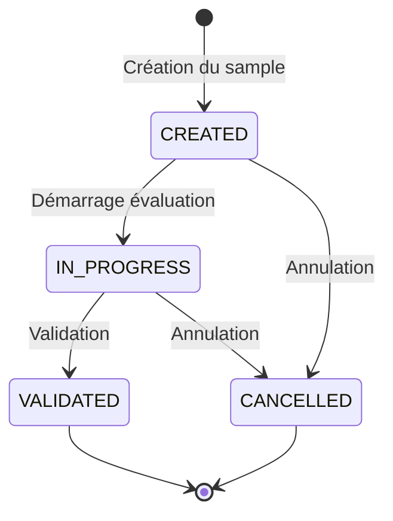

# Spécification fonctionnelle

## 1. Concepts métier

### 1.1 Échantillon d'évaluation (EvaluationSample)

Un **échantillon** représente une campagne d'évaluation. Il contient un ensemble de réponses du bot sélectionnées sur une période donnée.

| Attribut | Description |
|----------|-------------|
| `name` | Nom optionnel pour identifier l'échantillon |
| `description` | Description libre de l'objectif de l'évaluation |
| `startDate` / `endDate` | Période de sélection des dialogs |
| `requestedDialogCount` | Nombre de dialogs demandés |
| `includeTestDialogs` | Inclure ou non les dialogs de test |
| `status` | État de l'échantillon |
| `createdBy` | Utilisateur ayant créé l'échantillon |
| `validatedBy` | Utilisateur ayant validé l'évaluation |

### 1.2 Réponse du bot (BotResponse)

Une **réponse du bot** est un message envoyé par le bot à un utilisateur. C'est l'unité d'évaluation.

| Attribut | Description |
|----------|-------------|
| `dialogId` | Référence au dialog d'origine |
| `actionId` | Référence à l'action d'origine |
| `botMessage` | Contenu du message du bot (snapshoté) |
| `userMessage` | Question de l'utilisateur (contexte) — *voir Q4* |
| `date` | Date du message |

### 1.3 Évaluation (Evaluation)

Une **évaluation** est le jugement porté sur une réponse du bot.

| Attribut | Description |
|----------|-------------|
| `status` | OK ou KO |
| `reason` | Raison du KO (optionnelle) |
| `comment` | Commentaire libre (optionnel) |
| `evaluatedBy` | Utilisateur ayant évalué |

### 1.4 Raisons de KO

Réutilisation de la liste des annotations existantes :

| Valeur | Description |
|--------|-------------|
| `INACCURATE_ANSWER` | Réponse inexacte |
| `INCOMPLETE_ANSWER` | Réponse incomplète |
| `HALLUCINATION` | Hallucination |
| `INCOMPLETE_SOURCES` | Sources incomplètes |
| `OBSOLETE_SOURCES` | Sources obsolètes |
| `WRONG_ANSWER_FORMAT` | Mauvais format de réponse |
| `BUSINESS_LEXICON_PROBLEM` | Problème de lexique métier |
| `QUESTION_MISUNDERSTOOD` | Question mal comprise |
| `OTHER` | Autre |

### 1.5 États du cycle de vie

| État | Description |
|------|-------------|
| `CREATED` | Échantillon créé, pas encore commencé |
| `IN_PROGRESS` | Évaluation en cours |
| `VALIDATED` | Évaluation terminée et validée |
| `CANCELLED` | Échantillon annulé |

---

## 2. Règles métier

### 2.1 Création d'échantillon

1. Les dialogs **annotés** (via le système d'annotations existant) sont **exclus**
2. Les dialogs sont sélectionnés dans la période spécifiée — *voir Q1*
3. Si `includeTestDialogs = false`, exclure les dialogs de test
4. Si pas assez de dialogs/réponses disponibles — *voir Q2*

### 2.2 Sélection des réponses à évaluer

1. **Filtrage par date** : actions avec `date ≤ sample.creationDate`
2. **Filtrage par émetteur** : actions du **bot** uniquement (`playerId.type = bot`)
3. **Snapshot** : le contenu des messages est copié à la création

### 2.3 Évaluation

1. Une réponse peut être **réévaluée** tant que l'échantillon n'est pas validé
2. Les dialogs déjà évalués peuvent réapparaître dans un nouvel échantillon (vierges)
3. La **raison du KO est optionnelle**
4. **Plusieurs évaluateurs** peuvent travailler simultanément

### 2.4 Validation

1. **Toutes les réponses** doivent être évaluées avant validation
2. Une fois validé, l'échantillon **ne peut plus être modifié**

### 2.5 Conservation et purge

1. Les échantillons sont **purgés** selon la même politique que les dialogs
2. La liste affiche les échantillons des **365 derniers jours**

---

## 3. Statistiques

### 3.1 Métriques en temps réel

| Métrique | Description |
|----------|-------------|
| `totalBotResponses` | Nombre total de réponses du bot à évaluer |
| `totalDialogs` | Nombre de dialogs distincts |
| `okCount` | Nombre de réponses évaluées OK |
| `koCount` | Nombre de réponses évaluées KO |
| `evaluatedCount` | Nombre total de réponses évaluées |
| `remainingCount` | Nombre de réponses restantes à évaluer |
| `okPercentage` | Pourcentage de OK |
| `koPercentage` | Pourcentage de KO |

### 3.2 Répartition des KO par raison

Groupement des KO par raison avec nombre et pourcentage.

---

## 4. Interface utilisateur

### 4.1 Liste des échantillons

- Affiche les échantillons des 365 derniers jours
- Filtres : statut, application
- Colonnes : nom, description, dates, créateur, statut, progression, actions

### 4.2 Création d'échantillon

Formulaire avec :
- Nom (optionnel)
- Description (optionnelle)
- Date début / Date fin
- Nombre de dialogs à évaluer
- Case à cocher : inclure les dialogs de test

### 4.3 Vue d'évaluation

- **En-tête** : informations du sample + statistiques temps réel
- **Liste des réponses** : 
  - Message utilisateur (contexte)
  - Réponse du bot
  - Boutons OK / KO
  - Dropdown raison (si KO, optionnel)
  - Champ commentaire (optionnel)
- **Actions** :
  - Bouton "Valider" (actif si toutes les réponses évaluées)
  - Modal de confirmation

---

## 5. Questions à trancher

### Q1 : Sélection des dialogs

**Comment sélectionner les dialogs dans la période ?**

| Option | Description |
|--------|-------------|
| Aléatoire | Sélection aléatoire parmi les dialogs éligibles |
| Chronologique | Les plus récents d'abord (ou les plus anciens) |
| Répartition uniforme | Répartir sur toute la période |

### Q2 : Pas assez de réponses

**Que faire si le nombre de réponses disponibles < nombre demandé ?**

| Option | Description |
|--------|-------------|
| Prendre tout | Prendre toutes les réponses disponibles, informer l'utilisateur |
| Bloquer | Empêcher la création et afficher un message d'erreur |
| Avertir | Créer le sample avec moins de réponses et afficher un avertissement |

### Q3 : Option de stockage

**Option B (snapshots séparés) ou Option C (contenu intégré) ?**

→ Voir [TECHNICAL.md](./TECHNICAL.md#options-de-stockage)

### Q4 : Contenu à stocker

**Quelles données snapshoter pour chaque réponse ?**

| Donnée | Stocker ? |
|--------|-----------|
| `botMessage` | ✅ Oui (obligatoire) |
| `userMessage` | ❓ À décider |
| `date` | ✅ Oui |
| `dialogId` / `actionId` | ✅ Oui |

### Q5 : Format d'export

**Format retenu : PDF**

Export du rapport au format PDF (document formaté, prêt à imprimer).

