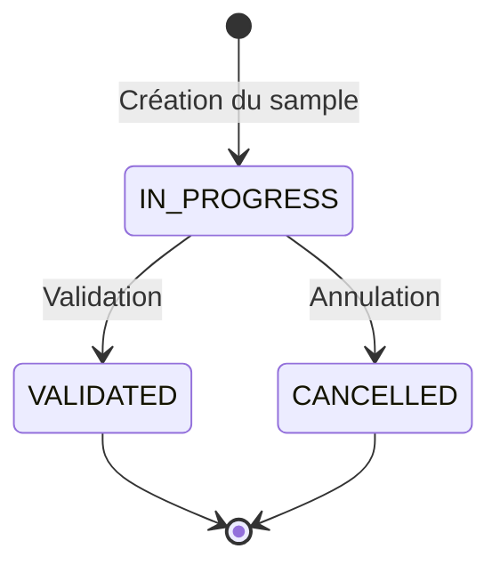

# Spécification fonctionnelle

## 1. Concepts métier

### 1.1 Échantillon d'évaluation (EvaluationSample)

Un **échantillon** représente une campagne d'évaluation. Il contient un ensemble de réponses du bot sélectionnées sur une période donnée.

| Attribut | Description |
|----------|-------------|
| `name` | Nom optionnel pour identifier l'échantillon |
| `description` | Description libre de l'objectif de l'évaluation |
| `dialogActivityFrom` | Date de début de la période d'activité des dialogs |
| `dialogActivityTo` | Date de fin de la période d'activité des dialogs |
| `requestedDialogCount` | Nombre de dialogs demandés |
| `dialogsCount` | Nombre de dialogs retournés (peut différer si pas assez de dialogs) |
| `totalDialogCount` | Nombre total de dialogs dans la période (indépendamment de la limite) |
| `botActionCount` | Nombre total d'actions du bot retournées |
| `allowTestDialogs` | Autoriser ou non les dialogs de test |
| `status` | État de l'échantillon |
| `createdBy` | Utilisateur ayant créé l'échantillon |
| `creationDate` | Date de création |
| `validatedBy` | Utilisateur ayant validé l'évaluation |
| `validationDate` | Date de validation |
| `cancelledBy` | Utilisateur ayant annulé l'échantillon |
| `cancelDate` | Date d'annulation |
| `evaluationsResult` | Résultat de l'évaluation (agrégé) |

### 1.2 Résultat d'évaluation (EvaluationsResult)

> **Note:** Calculé à la volée, non persisté en base.

| Attribut | Description |
|----------|-------------|
| `positiveCount` | Nombre d'évaluations OK |
| `negativeCount` | Nombre d'évaluations KO |

### 1.3 Évaluation (Evaluation)

Une **évaluation** est le jugement porté sur une réponse du bot. Initialisée à la création du sample en BDD (avec les champs d'évaluation à `null`).

| Attribut | Description |
|----------|-------------|
| `id` | Identifiant unique |
| `evaluationSampleId` | Référence à l'échantillon |
| `dialogId` | Référence au dialog d'origine |
| `actionId` | Référence à l'action d'origine |
| `evaluation` | OK ou KO (nullable) |
| `reason` | Raison du KO (nullable) |
| `evaluatedBy` | Utilisateur ayant évalué (nullable) |
| `evaluationDate` | Date de l'évaluation (nullable) |

### 1.4 Raisons de KO

Réutilisation de la liste des annotations existantes :

| Valeur | Description |
|--------|-------------|
| `INACCURATE_ANSWER` | Réponse inexacte |
| `INCOMPLETE_ANSWER` | Réponse incomplète |
| `HALLUCINATION` | Hallucination |
| `INCOMPLETE_SOURCES` | Sources incomplètes |
| `OBSOLETE_SOURCES` | Sources obsolètes |
| `WRONG_ANSWER_FORMAT` | Mauvais format de réponse |
| `BUSINESS_LEXICON_PROBLEM` | Problème de lexique métier |
| `QUESTION_MISUNDERSTOOD` | Question mal comprise |
| `OTHER` | Autre |

> **TODO:** Vérifier si on utilise les mêmes valeurs que pour les annotations existantes.

### 1.5 États du cycle de vie

> **Note:** Pas d'état CREATED. Le sample passe directement en IN_PROGRESS à la création.
> Si la création échoue partiellement, le sample et les évaluations créées doivent être rollback (transaction).

| État | Description |
|------|-------------|
| `IN_PROGRESS` | Évaluation en cours |
| `VALIDATED` | Évaluation terminée et validée |
| `CANCELLED` | Échantillon annulé |

---

## 2. Règles métier

### 2.1 Création d'échantillon

1. Les dialogs **annotés** (via le système d'annotations existant) sont **exclus**
2. Les dialogs sont sélectionnés dans la période spécifiée, par période d'activité (aléatoirement)
3. Si `allowTestDialogs = false`, exclure les dialogs de test
4. Si pas assez de dialogs/réponses disponibles → prendre tout ce qui est disponible

### 2.2 Sélection des réponses à évaluer

1. **Filtrage par période** : dialogs ayant eu une activité entre `dialogActivityFrom` et `dialogActivityTo`
2. **Filtrage par émetteur** : actions du **bot** uniquement

### 2.3 Évaluation

1. Une réponse peut être **réévaluée** tant que l'échantillon n'est pas validé
2. Les dialogs déjà évalués peuvent réapparaître dans un nouvel échantillon (vierges)
3. La **raison du KO est optionnelle**
4. **Plusieurs évaluateurs** peuvent travailler simultanément
5. Un évaluateur **peut modifier** l'évaluation d'un autre évaluateur
6. En cas de **conflit d'écriture** (erreur BDD), retourner une erreur 409 Conflict

### 2.4 Validation et Annulation

1. **Toutes les réponses** doivent être évaluées avant validation
2. Une fois validé, l'échantillon **ne peut plus être modifié**
3. **Tout utilisateur** avec les droits peut valider ou annuler un échantillon
4. L'**export PDF** est une feature séparée (hors scope de ce design)

### 2.5 Conservation et purge

1. Les échantillons sont **purgés** selon la même politique que les dialogs
2. La liste affiche les échantillons des **365 derniers jours**

---

## 3. Questions tranchées

| # | Question | Réponse |
|---|----------|---------|
| Q1 | Sélection des dialogs | Aléatoire |
| Q2 | Pas assez de réponses | Prendre tout |
| Q4 | Stocker `userMessage` / `botMessage` ? | Non, utilisation des dialogs existants |
| Q5 | Format d'export | PDF |
