# Spécification fonctionnelle

Ce document décrit les flux fonctionnels avec les appels API, les statuts et retours possibles.

---

## 1. Création d'un ensemble d'évaluation

### Flux

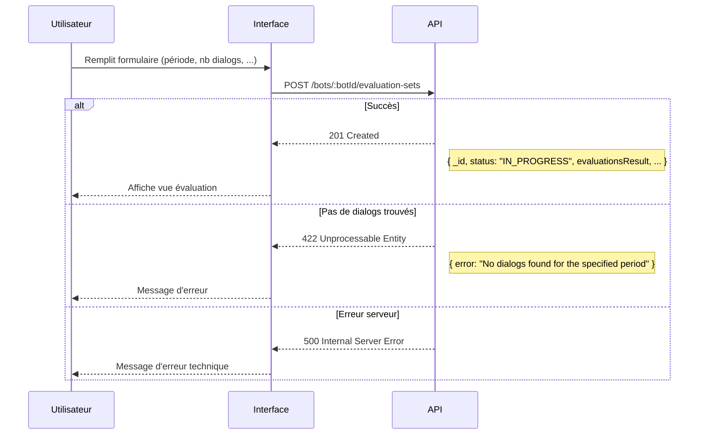

### Appel API

```http
POST /bots/my-bot/evaluation-sets
Content-Type: application/json

{
  "name": "Évaluation Q1 2026",
  "description": "Vérification qualité avant mise en prod",
  "dialogActivityFrom": "2026-01-01T00:00:00Z",
  "dialogActivityTo": "2026-01-14T23:59:59Z",
  "requestedDialogCount": 50,
  "allowTestDialogs": false
}
```

### Réponses possibles

| Code | Cas | Body |
|------|-----|------|
| 201 | Succès | Ensemble créé avec `evaluationsResult` |
| 422 | Aucun dialog trouvé | `{ error: "No dialogs found..." }` |
| 422 | Période invalide | `{ error: "Invalid date range" }` |
| 500 | Erreur technique | `{ error: "Internal server error" }` |

---

## 2. Liste des ensembles

### Flux

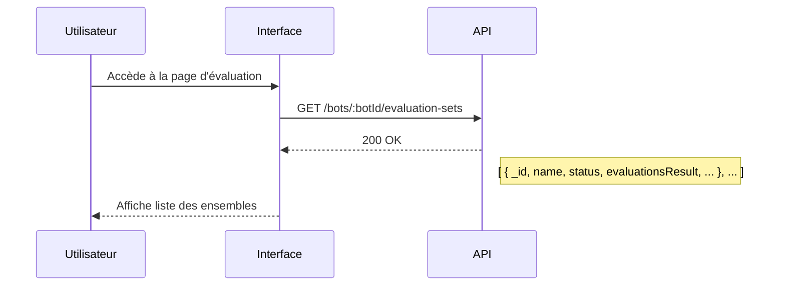

### Appel API

```http
GET /bots/my-bot/evaluation-sets?status=IN_PROGRESS
```

### Réponses possibles

| Code | Cas | Body |
|------|-----|------|
| 200 | Succès | Liste des ensembles (peut être vide `[]`) |

---

## 3. Récupération d'un ensemble

### Flux

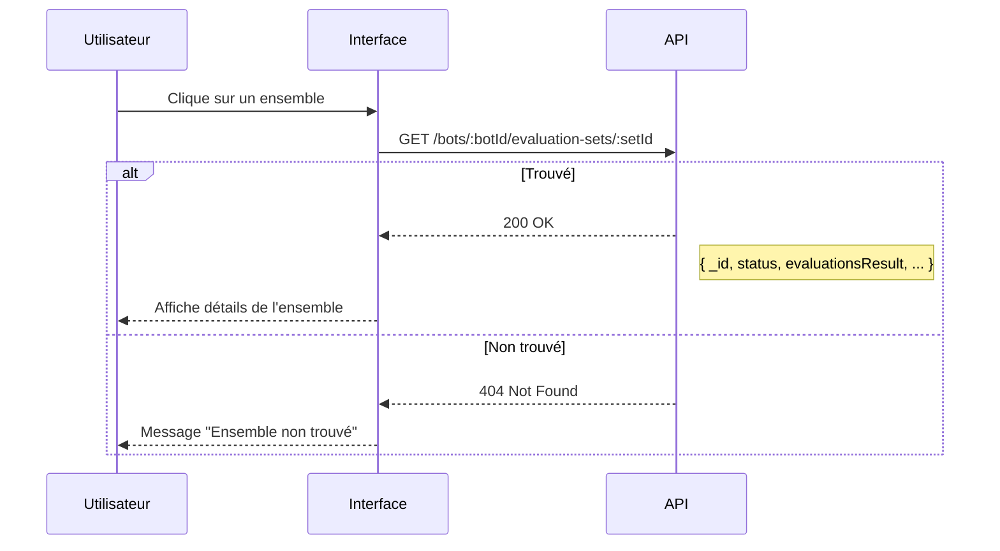

### Appel API

```http
GET /bots/my-bot/evaluation-sets/507f1f77bcf86cd799439011
```

### Réponses possibles

| Code | Cas | Body |
|------|-----|------|
| 200 | Succès | Ensemble avec `evaluationsResult` |
| 404 | Non trouvé | `{ error: "Evaluation set not found" }` |

---

## 4. Récupération des bot-refs (paginé)

### Flux - Chargement initial


### Flux - Pagination

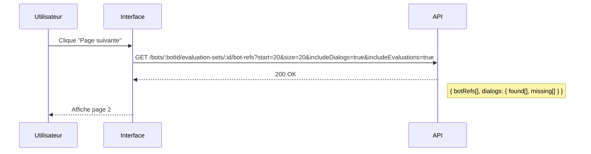

### Flux - Filtrage par statut

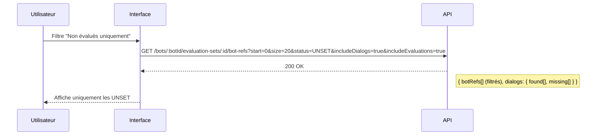

### Appel API

```http
GET /bots/my-bot/evaluation-sets/507f1f77bcf86cd799439011/bot-refs?start=0&size=20&includeDialogs=true&includeEvaluations=true&status=UNSET
```

### Query Parameters

| Param | Type | Défaut | Description |
|-------|------|--------|-------------|
| `start` | int | 0 | Index de début |
| `size` | int | 20 | Nombre d'éléments |
| `includeDialogs` | boolean | false | Inclure les dialogs |
| `includeEvaluations` | boolean | true | Inclure les évaluations |
| `status` | string | - | Filtrer par `UNSET`, `UP`, `DOWN` |

### Réponses possibles

| Code | Cas | Body |
|------|-----|------|
| 200 | Succès | `{ start, end, total, botRefs[], dialogs: { found[], missing[] } }` |
| 404 | Set non trouvé | `{ error: "Evaluation set not found" }` |

---

## 5. Évaluer une réponse

### Flux - Évaluation UP

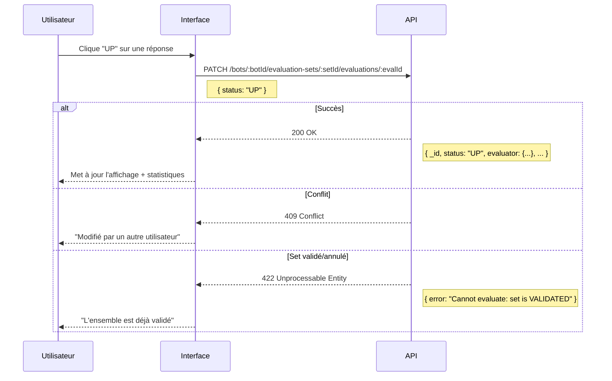

### Flux - Évaluation DOWN avec raison

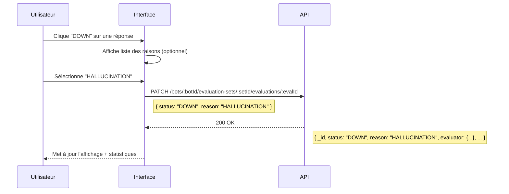

### Flux - Modification d'une évaluation

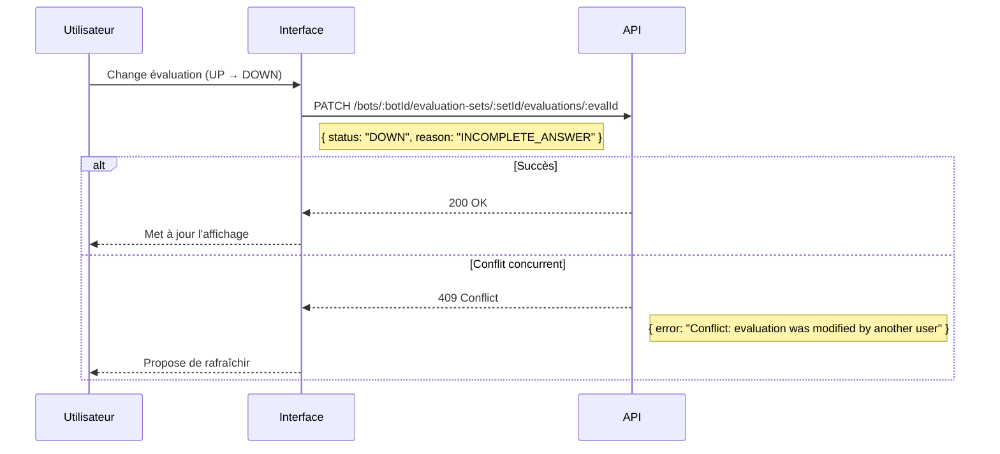

### Appel API

```http
PATCH /bots/my-bot/evaluation-sets/507f1f77bcf86cd799439011/evaluations/507f1f77bcf86cd799439012
Content-Type: application/json

{
  "status": "DOWN",
  "reason": "HALLUCINATION"
}
```

### Request Body

| Champ | Type | Required | Description |
|-------|------|----------|-------------|
| `status` | string | Oui | `UP` ou `DOWN` |
| `reason` | string | Non | Raison du DOWN |

### Réponses possibles

| Code | Cas | Body |
|------|-----|------|
| 200 | Succès | Évaluation mise à jour |
| 404 | Évaluation non trouvée | `{ error: "Evaluation not found" }` |
| 409 | Conflit concurrent | `{ error: "Conflict: evaluation was modified..." }` |
| 422 | Set validé/annulé | `{ error: "Cannot evaluate: set is VALIDATED" }` |

---

## 6. Validation d'un ensemble

### Flux - Succès

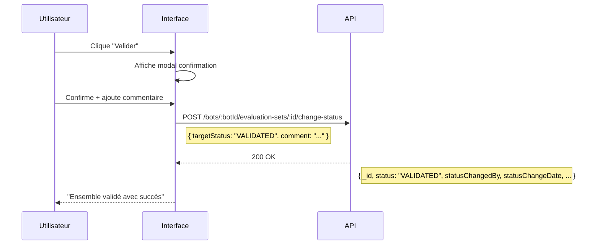

### Flux - Évaluations manquantes

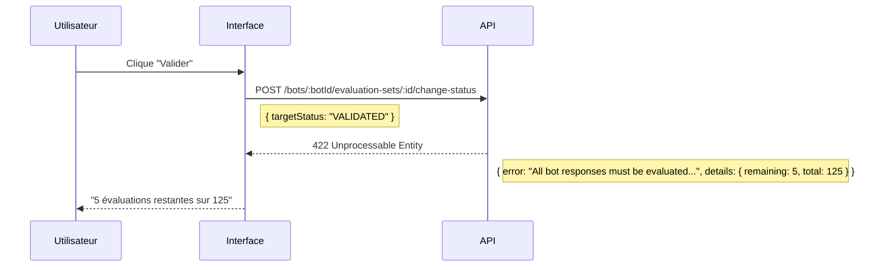

### Appel API

```http
POST /bots/my-bot/evaluation-sets/507f1f77bcf86cd799439011/change-status
Content-Type: application/json

{
  "targetStatus": "VALIDATED",
  "comment": "Évaluation complète, bot validé pour mise en prod"
}
```

### Réponses possibles

| Code | Cas | Body |
|------|-----|------|
| 200 | Succès | Ensemble avec nouveau statut |
| 404 | Set non trouvé | `{ error: "Evaluation set not found" }` |
| 422 | Évaluations manquantes | `{ error: "All bot responses must be evaluated...", details: { remaining, total } }` |
| 422 | Déjà validé/annulé | `{ error: "Invalid status transition", details: { currentStatus, targetStatus, allowedTransitions } }` |

---

## 7. Annulation d'un ensemble

### Flux - Succès

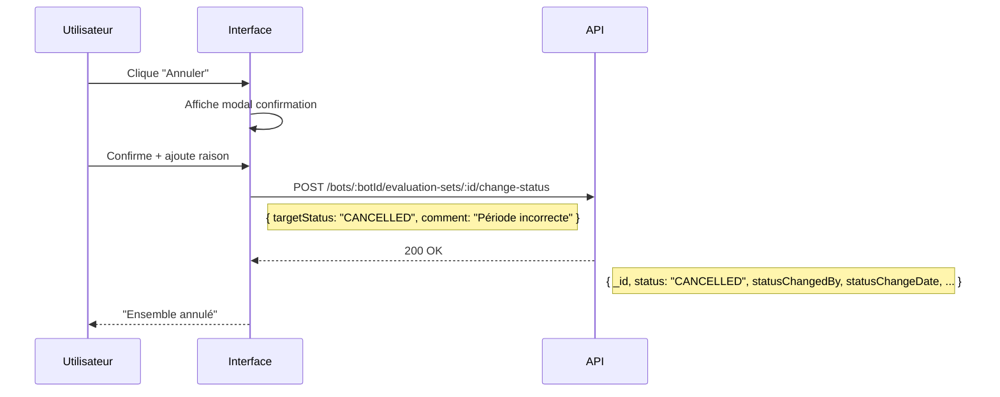

### Flux - Déjà validé

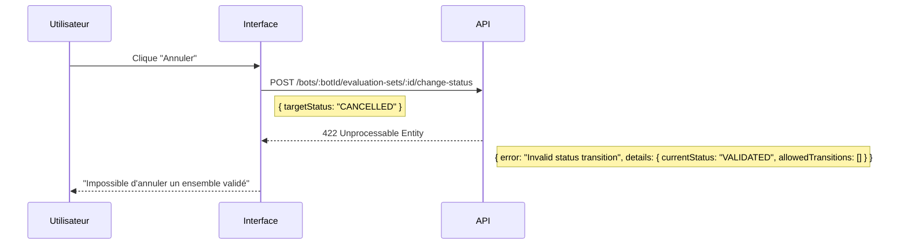

### Appel API

```http
POST /bots/my-bot/evaluation-sets/507f1f77bcf86cd799439011/change-status
Content-Type: application/json

{
  "targetStatus": "CANCELLED",
  "comment": "Période d'évaluation incorrecte"
}
```

### Réponses possibles

| Code | Cas | Body |
|------|-----|------|
| 200 | Succès | Ensemble avec nouveau statut |
| 404 | Set non trouvé | `{ error: "Evaluation set not found" }` |
| 422 | Déjà validé | `{ error: "Invalid status transition", details: { currentStatus, allowedTransitions } }` |

---

## 8. Résumé des codes de retour

| Code | Signification | Cas d'usage |
|------|---------------|-------------|
| 200 | OK | Requête réussie (GET, PATCH, POST change-status) |
| 201 | Created | Création réussie (POST création) |
| 404 | Not Found | Ressource non trouvée |
| 409 | Conflict | Conflit de modification concurrente |
| 422 | Unprocessable Entity | Règle métier non respectée |
| 500 | Internal Server Error | Erreur technique |

---

## 9. Résumé des endpoints

| Méthode | Endpoint | Description |
|---------|----------|-------------|
| `GET` | `/bots/:botId/evaluation-sets` | Liste des ensembles |
| `POST` | `/bots/:botId/evaluation-sets` | Créer un ensemble |
| `GET` | `/bots/:botId/evaluation-sets/:id` | Récupérer un ensemble |
| `GET` | `/bots/:botId/evaluation-sets/:id/bot-refs` | Liste des bot-refs paginée |
| `PATCH` | `/bots/:botId/evaluation-sets/:id/evaluations/:evalId` | Évaluer une réponse |
| `POST` | `/bots/:botId/evaluation-sets/:id/change-status` | Changer le statut |
