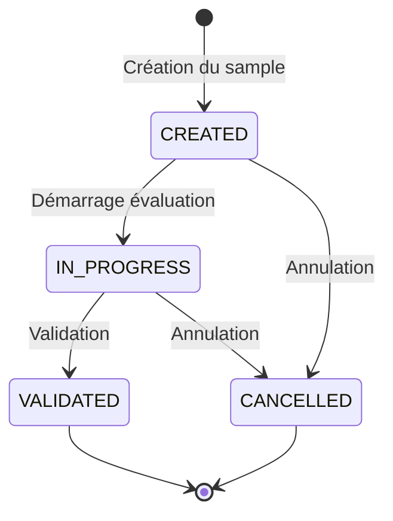

# Spécification fonctionnelle

## 1. Concepts métier

### 1.1 Échantillon d'évaluation (EvaluationSample)

Un **échantillon** représente une campagne d'évaluation. Il contient un ensemble de réponses du bot sélectionnées sur une période donnée.

| Attribut | Description |
|----------|-------------|
| `name` | Nom optionnel pour identifier l'échantillon |
| `description` | Description libre de l'objectif de l'évaluation |
| `dialogActivityFrom et dialogActivityTo` | Période de sélection avec un dialogeu ayant eu une activité pendant la période|
| `requestedDialogCount` | Nombre de dialogs demandés |
| `dialogsCount` | Nombre de dialogs retourné, peut différer du requested dans le cas ou pas assez de dialogs |

| `totalDialogCount` | Nombre de dialog total dans la periode, indépendemment de la limite requestedDialogCount de l'echantillonnage |

| `botActionCount` | nombre de total de action de bot retourné|
| `allowTestDialogs` | Autoriser ou non les dialogs de test |
| `status` | État de l'échantillon |
| `createdBy` | Utilisateur ayant créé l'échantillon |
| `creationDate` | Utilisateur ayant créé l'échantillon |
| `createdBy` | Utilisateur ayant créé l'échantillon |
| `validationDate` | Utilisateur ayant validé l'évaluation |
| `cancelDate` | Utilisateur ayant validé l'évaluation |
| `cancelledBy` | Utilisateur ayant validé l'évaluation |
| `evaluationsResult` | resultat de l'évalution |

evaluationsResult: 
| `positiveCount` | |
| `negativeCount` | |

### 1.3 Évaluation (Evaluation)

Une **évaluation** est le jugement porté sur une réponse du bot.

| Attribut | Description |
|----------|-------------|
| `evalution` | OK ou KO - nullable|
| `reason` | Raison du KO - nullable |
| `evaluatedBy` | Utilisateur ayant évalué - nullable |
| `evaluationDate` | Utilisateur ayant évalué - nullable |
| `dialogId` | Référence au dialog d'origine |
| `actionId` | Référence à l'action d'origine |
| `evaluationSampleId` | Référence à l'echantillon|

Initialisé à la creation en BDD. 

### 1.4 Raisons de KO

Réutilisation de la liste des annotations existantes :

| Valeur | Description |
|--------|-------------|
| `INACCURATE_ANSWER` | Réponse inexacte |
| `INCOMPLETE_ANSWER` | Réponse incomplète |
| `HALLUCINATION` | Hallucination |
| `INCOMPLETE_SOURCES` | Sources incomplètes |
| `OBSOLETE_SOURCES` | Sources obsolètes |
| `WRONG_ANSWER_FORMAT` | Mauvais format de réponse |
| `BUSINESS_LEXICON_PROBLEM` | Problème de lexique métier |
| `QUESTION_MISUNDERSTOOD` | Question mal comprise |
| `OTHER` | Autre |

TODO: a verifier mais utiliser les même valeurs que pour les annotations

### 1.5 États du cycle de vie

TODO: mettre a jour les schemas

| État | Description |
|------|-------------|
| `CREATED` | Échantillon créé, pas encore commencé |
| `IN_PROGRESS` | Évaluation en cours |
| `VALIDATED` | Évaluation terminée et validée |
| `CANCELLED` | Échantillon annulé |

---

## 2. Règles métier

### 2.1 Création d'échantillon

1. Les dialogs **annotés** (via le système d'annotations existant) sont **exclus**
2. Les dialogs sont sélectionnés dans la période spécifiée, par periode d'activité — *voir Q1*
3. Si `includeTestDialogs = false`, exclure les dialogs de test
4. Si pas assez de dialogs/réponses disponibles — *voir Q2*

### 2.2 Sélection des réponses à évaluer

1. **Filtrage par date** : 

### 2.3 Évaluation

1. Une réponse peut être **réévaluée** tant que l'échantillon n'est pas validé
2. Les dialogs déjà évalués peuvent réapparaître dans un nouvel échantillon (vierges)
3. La **raison du KO est optionnelle**
4. **Plusieurs évaluateurs** peuvent travailler simultanément

### 2.4 Validation

1. **Toutes les réponses** doivent être évaluées avant validation
2. Une fois validé, l'échantillon **ne peut plus être modifié**

### 2.5 Conservation et purge

1. Les échantillons sont **purgés** selon la même politique que les dialogs
2. La liste affiche les échantillons des **365 derniers jours**

---
