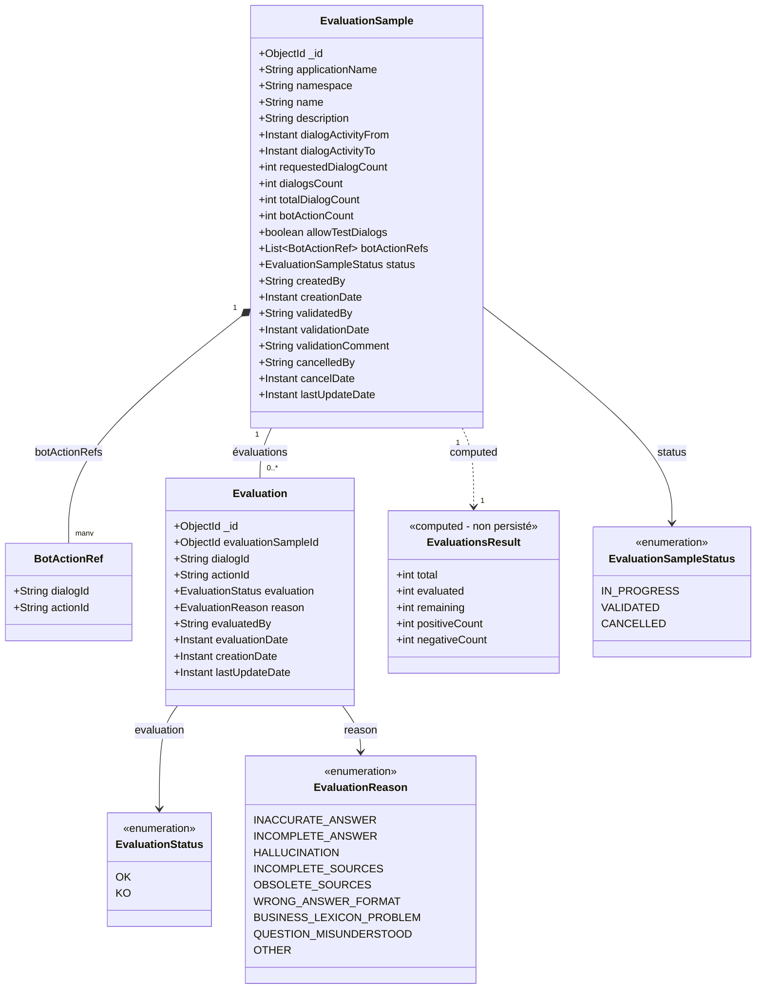
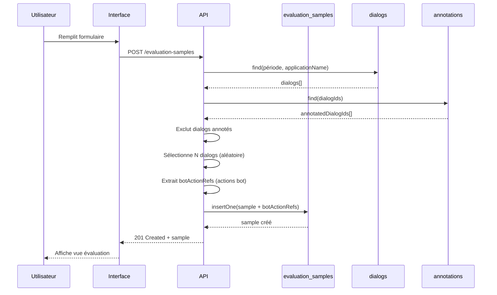
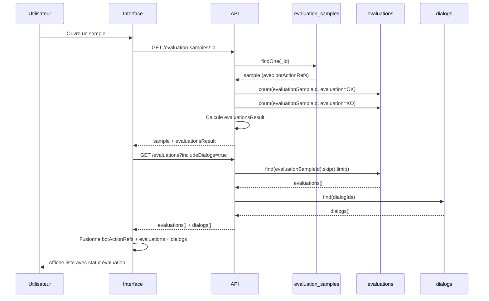
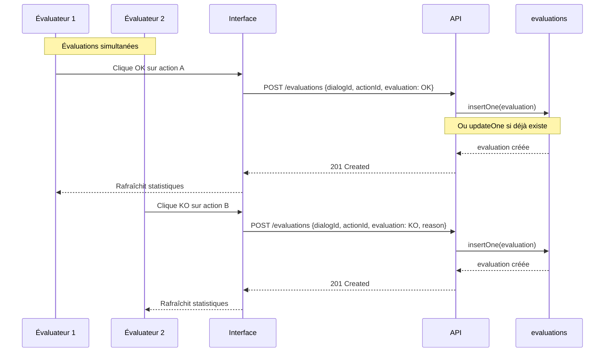
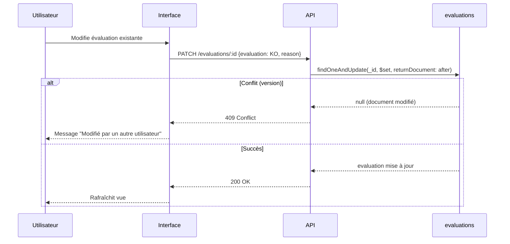
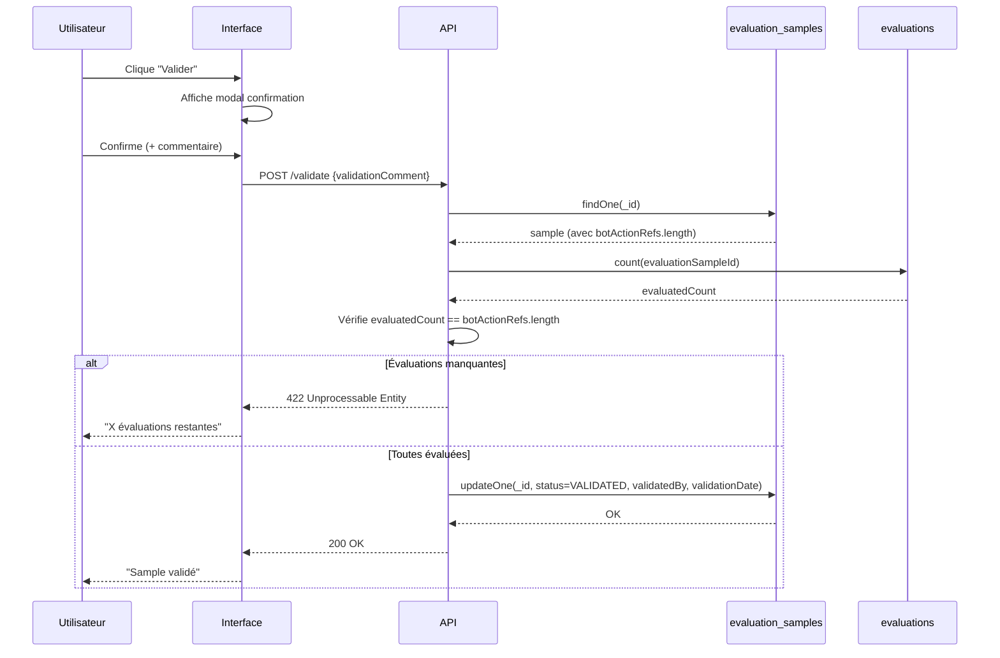
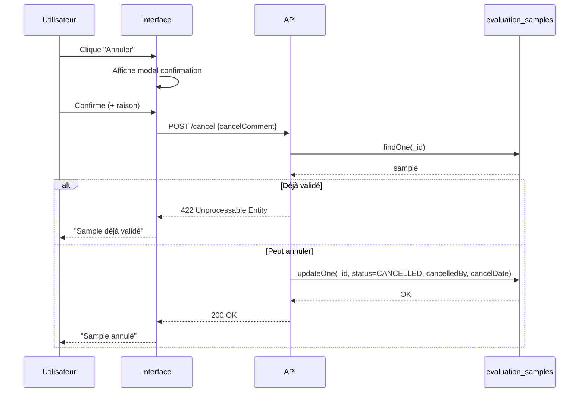

# Spécification technique

## 1. Diagramme de classes

### 1.1 Modèle de données



### 1.2 Relations

| Relation | Description |
|----------|-------------|
| `EvaluationSample` → `BotActionRef` | Liste des actions à évaluer (embedded) |
| `EvaluationSample` → `EvaluationsResult` | Calculé à la volée (non persisté) |
| `EvaluationSample` → `Evaluation` | 0 à N évaluations (créées seulement si évaluées) |
| `Evaluation` → `Dialog` | Référence au dialog existant (pas de snapshot) |

---

## 2. Collections MongoDB

### 2.1 Collection `evaluation_samples`

**Description :** Stocke les échantillons d'évaluation avec les références aux actions à évaluer.

```javascript
{
  "_id": ObjectId("507f1f77bcf86cd799439011"),
  
  // Identification
  "applicationName": "my-bot",
  "namespace": "my-namespace",
  "name": "Évaluation Q1 2026",
  "description": "Vérification qualité avant mise en prod",
  
  // Critères de sélection
  "dialogActivityFrom": ISODate("2026-01-01T00:00:00Z"),
  "dialogActivityTo": ISODate("2026-01-14T23:59:59Z"),
  "requestedDialogCount": 50,
  "allowTestDialogs": false,
  
  // Résultats de la sélection
  "dialogsCount": 50,
  "totalDialogCount": 120,
  "botActionCount": 125,
  
  // Références aux actions à évaluer (embedded)
  "botActionRefs": [
    { "dialogId": "dialog_abc123", "actionId": "action_001" },
    { "dialogId": "dialog_abc123", "actionId": "action_003" },
    { "dialogId": "dialog_def456", "actionId": "action_002" }
    // ... jusqu'à botActionCount éléments
  ],
  
  // Cycle de vie
  "status": "IN_PROGRESS",  // IN_PROGRESS | VALIDATED | CANCELLED
  
  // Création
  "createdBy": "user-id-123",
  "creationDate": ISODate("2026-01-14T10:30:00Z"),
  
  // Validation (nullable)
  "validatedBy": null,
  "validationDate": null,
  "validationComment": null,
  
  // Annulation (nullable)
  "cancelledBy": null,
  "cancelDate": null,
  "cancelComment": null,
  
  // Métadonnées
  "lastUpdateDate": ISODate("2026-01-14T10:30:00Z")
}
```

**Index :**

| Index | Champs | Type | Justification |
|-------|--------|------|---------------|
| `_id_` | `_id` | Primary | Par défaut MongoDB |
| `idx_app_ns_status` | `applicationName`, `namespace`, `status` | Compound | Liste des samples par app/namespace |
| `idx_creation_date` | `creationDate` | Single (DESC) | Tri par date, purge |
| `idx_status` | `status` | Single | Filtrage par statut |

```javascript
// Création des index
db.evaluation_samples.createIndex({ "applicationName": 1, "namespace": 1, "status": 1 })
db.evaluation_samples.createIndex({ "creationDate": -1 })
db.evaluation_samples.createIndex({ "status": 1 })
```

---

### 2.2 Collection `evaluations`

**Description :** Stocke les évaluations effectuées. Un document est créé uniquement quand une action est évaluée.

```javascript
{
  "_id": ObjectId("507f1f77bcf86cd799439012"),
  
  // Références
  "evaluationSampleId": ObjectId("507f1f77bcf86cd799439011"),
  "dialogId": "dialog_abc123",
  "actionId": "action_001",
  
  // Évaluation
  "evaluation": "OK",  // OK | KO
  "reason": null,      // Si KO : INACCURATE_ANSWER, HALLUCINATION, etc.
  
  // Évaluateur
  "evaluatedBy": "user-id-456",
  "evaluationDate": ISODate("2026-01-14T11:00:00Z"),
  
  // Métadonnées
  "creationDate": ISODate("2026-01-14T11:00:00Z"),
  "lastUpdateDate": ISODate("2026-01-14T11:00:00Z")
}
```

**Index :**

| Index | Champs | Type | Justification |
|-------|--------|------|---------------|
| `_id_` | `_id` | Primary | Par défaut MongoDB |
| `idx_sample_id` | `evaluationSampleId` | Single | Récupérer toutes les évaluations d'un sample |
| `idx_sample_dialog_action` | `evaluationSampleId`, `dialogId`, `actionId` | Compound + Unique | Unicité, recherche rapide |
| `idx_evaluation` | `evaluation` | Single | Stats par statut (OK/KO) |
| `idx_creation_date` | `creationDate` | Single (DESC) | Purge |

```javascript
// Création des index
db.evaluations.createIndex({ "evaluationSampleId": 1 })
db.evaluations.createIndex(
  { "evaluationSampleId": 1, "dialogId": 1, "actionId": 1 }, 
  { unique: true }
)
db.evaluations.createIndex({ "evaluation": 1 })
db.evaluations.createIndex({ "creationDate": -1 })
```

---

### 2.3 Collection existante `dialogs`

**Description :** Collection existante de Tock. Les évaluations référencent les dialogs sans duplication.

```javascript
{
  "_id": ObjectId("dialog_abc123"),
  "playerIds": [...],
  "stories": [...],
  "actions": [
    {
      "_id": "action_001",
      "playerId": { "type": "bot", ... },
      "date": ISODate("2026-01-10T14:30:00Z"),
      "message": {
        "text": "Bonjour, comment puis-je vous aider ?"
      }
    },
    {
      "_id": "action_002",
      "playerId": { "type": "user", ... },
      "date": ISODate("2026-01-10T14:30:05Z"),
      "message": {
        "text": "Je veux réserver un train"
      }
    }
    // ...
  ]
}
```

> ⚠️ **Attention :** Les dialogs peuvent être purgés. Si un dialog est supprimé, l'évaluation reste mais sans contexte.

---

## 3. Flux de données

### 3.1 Création du sample



### 3.2 Chargement des évaluations



### 3.3 Évaluer une action



### 3.4 Modifier une évaluation



### 3.5 Validation



### 3.6 Annulation



---

## 4. Requêtes MongoDB fréquentes

### 4.1 Calculer evaluationsResult

```javascript
// Nombre d'évaluations par statut pour un sample
db.evaluations.aggregate([
  { $match: { evaluationSampleId: ObjectId("...") } },
  { $group: {
      _id: "$evaluation",
      count: { $sum: 1 }
  }}
])

// Résultat:
// [{ _id: "OK", count: 60 }, { _id: "KO", count: 20 }]
```

### 4.2 Vérifier si toutes les actions sont évaluées

```javascript
// Comparer botActionRefs.length avec le nombre d'évaluations
const sample = db.evaluation_samples.findOne({ _id: ObjectId("...") })
const evaluatedCount = db.evaluations.countDocuments({ 
  evaluationSampleId: sample._id 
})
const allEvaluated = evaluatedCount === sample.botActionRefs.length
```

### 4.3 Liste paginée des évaluations avec dialogs

```javascript
// Évaluations paginées
const evaluations = db.evaluations
  .find({ evaluationSampleId: ObjectId("...") })
  .skip(0)
  .limit(20)
  .toArray()

// Dialogs associés
const dialogIds = [...new Set(evaluations.map(e => e.dialogId))]
const dialogs = db.dialogs.find({ _id: { $in: dialogIds } }).toArray()
```

---

## 5. Points d'attention

1. **Performance** : La génération d'échantillon peut être lente si beaucoup de dialogs
2. **Concurrence** : Gérer les mises à jour simultanées (plusieurs évaluateurs)
3. **Rafraîchissement UI** : Polling ou WebSocket pour afficher les évaluations des autres
4. **Permissions** : Vérifier les droits d'accès (rôle `botUser`)
5. **Purge** : Les évaluations sans dialogs restent consultables mais sans contexte
6. **Taille botActionRefs** : Attention si beaucoup d'actions (limite document MongoDB 16MB)
