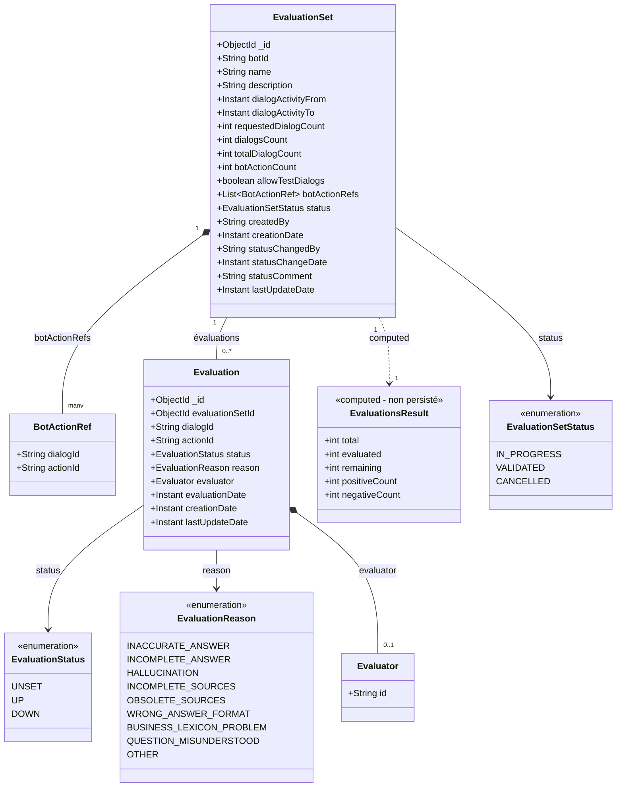

# Spécification technique

Ce document décrit l'implémentation technique : diagrammes de classes, collections MongoDB, index et requêtes.

---

## 1. Diagramme de classes



### Relations

| Relation | Description |
|----------|-------------|
| `EvaluationSet` → `BotActionRef` | Liste des actions à évaluer (embedded, paginable via `/bot-refs`) |
| `EvaluationSet` → `EvaluationsResult` | Calculé à la volée (non persisté) |
| `EvaluationSet` → `Evaluation` | 1 évaluation par BotActionRef (créées à l'initialisation avec `UNSET`) |
| `Evaluation` → `Evaluator` | Évaluateur (null si UNSET) |
| `Evaluation` → `Dialog` | Référence au dialog existant (peut être purgé → `dialogs.missing`) |

---

## 2. Collections MongoDB

### 2.1 Collection `evaluation_sets`

**Description :** Stocke les ensembles d'évaluation avec les références aux actions à évaluer.

```javascript
{
  "_id": ObjectId("507f1f77bcf86cd799439011"),
  
  // Identification
  "botId": "my-bot",
  "name": "Évaluation Q1 2026",
  "description": "Vérification qualité avant mise en prod",
  
  // Critères de sélection
  "dialogActivityFrom": ISODate("2026-01-01T00:00:00Z"),
  "dialogActivityTo": ISODate("2026-01-14T23:59:59Z"),
  "requestedDialogCount": 50,
  "allowTestDialogs": false,
  
  // Résultats de la sélection
  "dialogsCount": 50,
  "totalDialogCount": 120,
  "botActionCount": 125,
  
  // Références aux actions à évaluer (embedded)
  "botActionRefs": [
    { "dialogId": "dialog_abc123", "actionId": "action_001" },
    { "dialogId": "dialog_abc123", "actionId": "action_003" },
    { "dialogId": "dialog_def456", "actionId": "action_002" }
    // ... jusqu'à botActionCount éléments
  ],
  
  // Cycle de vie
  "status": "IN_PROGRESS",  // IN_PROGRESS | VALIDATED | CANCELLED
  
  // Création
  "createdBy": "user-id-123",
  "creationDate": ISODate("2026-01-14T10:30:00Z"),
  
  // Changement de statut (initialisé à la création)
  "statusChangedBy": "user-id-123",        // = createdBy à la création
  "statusChangeDate": ISODate("2026-01-14T10:30:00Z"),  // = creationDate à la création
  "statusComment": null,
  
  // Métadonnées
  "lastUpdateDate": ISODate("2026-01-14T10:30:00Z")
}
```

**Index :**

| Index | Champs | Type | Justification |
|-------|--------|------|---------------|
| `_id_` | `_id` | Primary | Par défaut MongoDB |
| `idx_bot_status` | `botId`, `status` | Compound | Liste des sets par bot |
| `idx_creation_date` | `creationDate` | Single (DESC) | Tri par date, purge |
| `idx_status` | `status` | Single | Filtrage par statut |

```javascript
// Création des index
db.evaluation_sets.createIndex({ "botId": 1, "status": 1 })
db.evaluation_sets.createIndex({ "creationDate": -1 })
db.evaluation_sets.createIndex({ "status": 1 })
```

> **Note:** Le namespace est géré au niveau de la session utilisateur, pas dans les données.

---

### 2.2 Collection `evaluations`

**Description :** Stocke les évaluations. Un document est créé pour chaque action à évaluer lors de la création de l'ensemble, avec `status = UNSET`.

```javascript
{
  "_id": ObjectId("507f1f77bcf86cd799439012"),
  
  // Références
  "evaluationSetId": ObjectId("507f1f77bcf86cd799439011"),
  "dialogId": "dialog_abc123",
  "actionId": "action_001",
  
  // Évaluation (UNSET par défaut)
  "status": "UNSET",  // UNSET | UP | DOWN
  "reason": null,     // Si DOWN : INACCURATE_ANSWER, HALLUCINATION, etc.
  
  // Évaluateur (null si UNSET)
  "evaluator": null,
  // Exemple après évaluation:
  // "evaluator": {
  //   "id": "user-id-456"
  // },
  
  "evaluationDate": null,
  
  // Métadonnées
  "creationDate": ISODate("2026-01-14T10:30:00Z"),
  "lastUpdateDate": ISODate("2026-01-14T10:30:00Z")
}
```

**Exemple après évaluation :**

```javascript
{
  "_id": ObjectId("507f1f77bcf86cd799439012"),
  "evaluationSetId": ObjectId("507f1f77bcf86cd799439011"),
  "dialogId": "dialog_abc123",
  "actionId": "action_001",
  
  "status": "DOWN",
  "reason": "HALLUCINATION",
  
  "evaluator": {
    "id": "user-id-456"
  },
  "evaluationDate": ISODate("2026-01-14T11:00:00Z"),
  
  "creationDate": ISODate("2026-01-14T10:30:00Z"),
  "lastUpdateDate": ISODate("2026-01-14T11:00:00Z")
}
```

**Index :**

| Index | Champs | Type | Justification |
|-------|--------|------|---------------|
| `_id_` | `_id` | Primary | Par défaut MongoDB |
| `idx_set_id` | `evaluationSetId` | Single | Récupérer toutes les évaluations d'un set |
| `idx_set_dialog_action` | `evaluationSetId`, `dialogId`, `actionId` | Compound + Unique | Unicité, recherche rapide |
| `idx_status` | `status` | Single | Stats par statut (UNSET/UP/DOWN) |
| `idx_creation_date` | `creationDate` | Single (DESC) | Purge |

```javascript
// Création des index
db.evaluations.createIndex({ "evaluationSetId": 1 })
db.evaluations.createIndex(
  { "evaluationSetId": 1, "dialogId": 1, "actionId": 1 }, 
  { unique: true }
)
db.evaluations.createIndex({ "status": 1 })
db.evaluations.createIndex({ "creationDate": -1 })
```

---

### 2.3 Collection existante `dialogs`

**Description :** Collection existante de Tock. Les évaluations référencent les dialogs sans duplication.

```javascript
{
  "_id": ObjectId("dialog_abc123"),
  "playerIds": [...],
  "stories": [...],
  "actions": [
    {
      "_id": "action_001",
      "playerId": { "type": "bot", ... },
      "date": ISODate("2026-01-10T14:30:00Z"),
      "message": {
        "text": "Bonjour, comment puis-je vous aider ?"
      }
    },
    {
      "_id": "action_002",
      "playerId": { "type": "user", ... },
      "date": ISODate("2026-01-10T14:30:05Z"),
      "message": {
        "text": "Je veux réserver un train"
      }
    }
    // ...
  ]
}
```

> ⚠️ **Attention :** Les dialogs peuvent être purgés. Si un dialog est supprimé, l'évaluation reste mais sans contexte.

---

## 3. Requêtes MongoDB fréquentes

### 3.1 Calculer evaluationsResult

```javascript
// Nombre d'évaluations par statut pour un set
db.evaluations.aggregate([
  { $match: { evaluationSetId: ObjectId("...") } },
  { $group: {
      _id: "$status",
      count: { $sum: 1 }
  }}
])

// Résultat:
// [{ _id: "UP", count: 60 }, { _id: "DOWN", count: 20 }, { _id: "UNSET", count: 45 }]
```

### 3.2 Vérifier si toutes les actions sont évaluées

```javascript
// Compter le nombre d'évaluations UNSET
const unsetCount = db.evaluations.countDocuments({ 
  evaluationSetId: ObjectId("..."),
  status: "UNSET"
})
const allEvaluated = unsetCount === 0
```

### 3.3 Liste paginée des bot-refs avec dialogs

```javascript
// 1. Récupérer le set et paginer les botActionRefs
const set = db.evaluation_sets.findOne({ _id: ObjectId("...") })
const pagedRefs = set.botActionRefs.slice(start, start + size)

// 2. Récupérer les évaluations correspondantes
const refFilters = pagedRefs.map(r => ({ dialogId: r.dialogId, actionId: r.actionId }))
const evaluations = db.evaluations.find({
  evaluationSetId: set._id,
  $or: refFilters
}).toArray()

// 3. Récupérer les dialogs (certains peuvent avoir été purgés)
const dialogIds = [...new Set(pagedRefs.map(r => r.dialogId))]
const foundDialogs = db.dialogs.find({ _id: { $in: dialogIds } }).toArray()
const foundDialogIds = new Set(foundDialogs.map(d => d._id))

// 4. Identifier les refs dont le dialog a été purgé
const missingRefs = pagedRefs.filter(r => !foundDialogIds.has(r.dialogId))
```

### 3.4 Statistiques rapides pour la liste des sets

```javascript
// Pour chaque set, calculer les stats rapidement
db.evaluations.aggregate([
  { $match: { evaluationSetId: { $in: [ObjectId("..."), ObjectId("...")] } } },
  { $group: {
      _id: { setId: "$evaluationSetId", status: "$status" },
      count: { $sum: 1 }
  }},
  { $group: {
      _id: "$_id.setId",
      stats: { $push: { status: "$_id.status", count: "$count" } }
  }}
])
```

---

## 4. Points d'attention

1. **Performance** : La génération d'ensemble peut être lente si beaucoup de dialogs
2. **Concurrence** : Gérer les mises à jour simultanées (plusieurs évaluateurs)
3. **Rafraîchissement UI** : Polling ou WebSocket pour afficher les évaluations des autres
4. **Permissions** : Vérifier les droits d'accès (rôle `botUser`)
5. **Purge** : Les évaluations sans dialogs restent consultables mais sans contexte
6. **Taille botActionRefs** : Attention si beaucoup d'actions (limite document MongoDB 16MB)
7. **Transaction** : La création de l'ensemble et des évaluations doit être atomique
