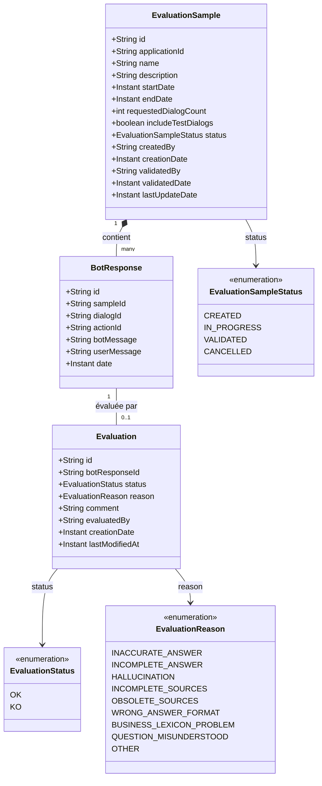
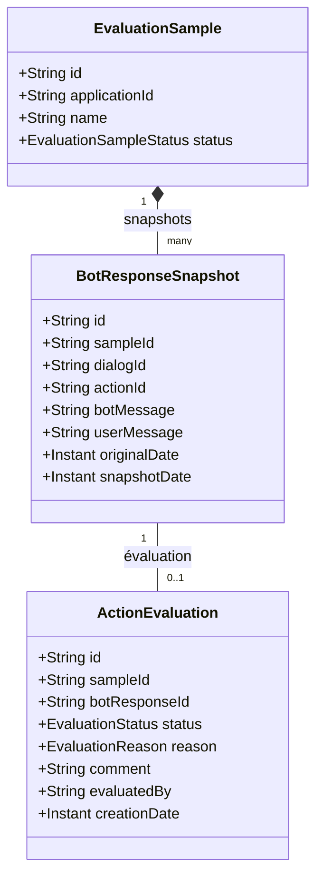
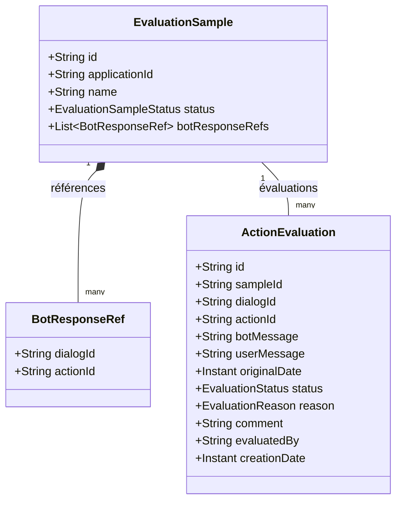
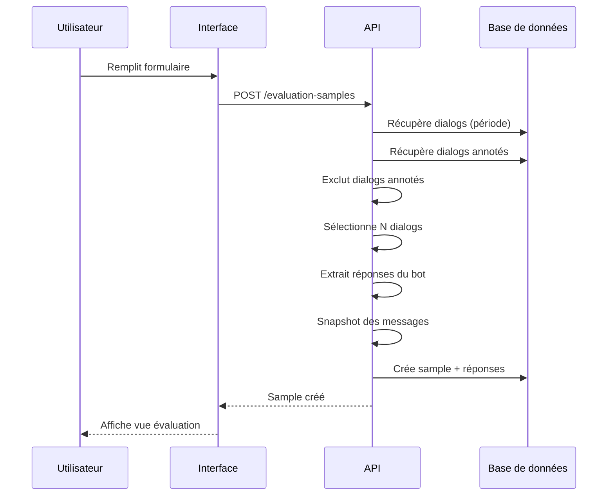
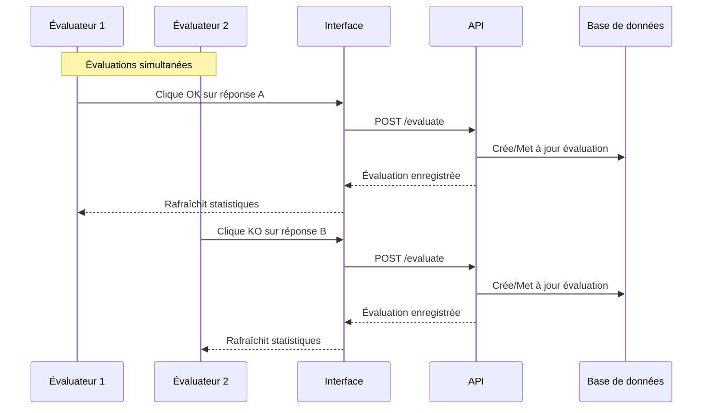
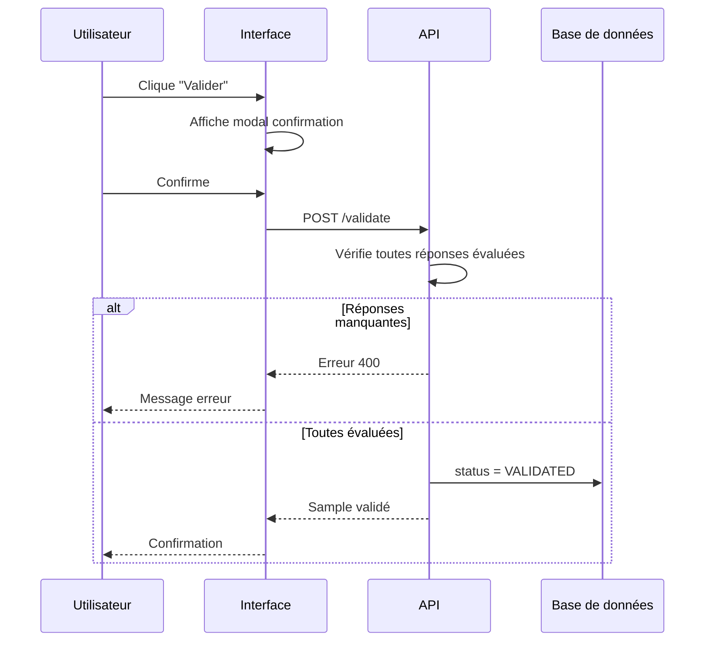

# Spécification technique

## 1. Diagramme de classes

### 1.1 Modèle conceptuel

### 1.2 Relations

| Relation | Description |
|----------|-------------|
| `EvaluationSample` → `BotResponse` | Un sample contient plusieurs réponses du bot |
| `BotResponse` → `Evaluation` | Une réponse peut avoir une évaluation (0 ou 1) |

---

## 2. Options de stockage

Les dialogs et actions peuvent être **purgés**. Les échantillons seront également purgés.

### 2.1 Option B : Snapshot dans le Sample

Les réponses du bot sont stockées dans une collection séparée liée au sample.

**Avantages :**
- ✅ Séparation claire snapshot / évaluation
- ✅ Une seule copie par réponse par sample

**Inconvénients :**
- ❌ Deux collections à gérer (snapshots + évaluations)

---

### 2.2 Option C : Évaluations avec contenu intégré

Les évaluations contiennent directement le snapshot du message.

**Avantages :**
- ✅ Une seule collection pour tout (évaluations)
- ✅ Données auto-portantes
- ✅ Plus simple à requêter

**Inconvénients :**
- ❌ Données dupliquées si plusieurs samples incluent la même réponse

---

### 2.3 Comparaison

| Critère | Option B | Option C |
|---------|----------|----------|
| **Collections** | 3 | 2 |
| **Duplication** | Faible | Possible |
| **Complexité** | Moyenne | Faible |
| **Requêtes** | Jointures | Directes |

---

## 3. Flux de données

### 3.1 Création du sample

### 3.2 Évaluation

### 3.3 Validation

---

## 4. Points d'attention

1. **Performance** : La génération d'échantillon peut être lente si beaucoup de dialogs
2. **Concurrence** : Gérer les mises à jour simultanées (plusieurs évaluateurs)
3. **Rafraîchissement UI** : Afficher les évaluations des autres utilisateurs en temps réel
4. **Permissions** : Vérifier les droits d'accès (rôle `botUser`)

